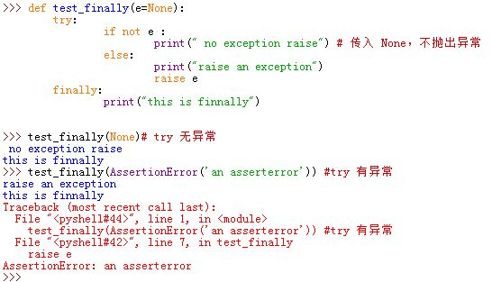
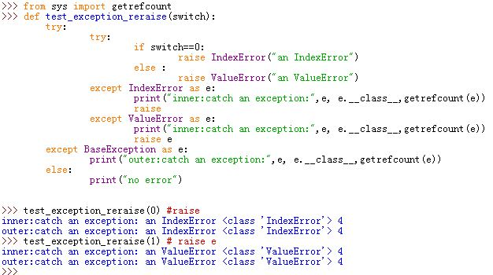
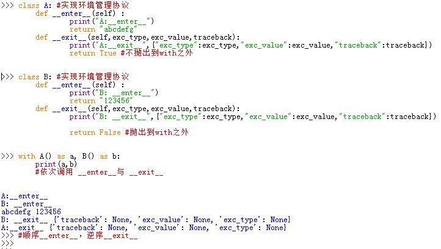
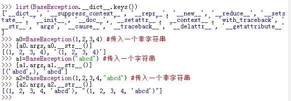
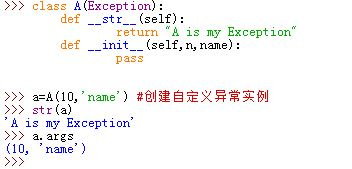
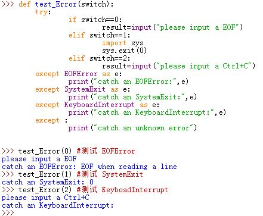

# 异常

##一、异常机制

1. Python中，异常会根据错误自动地被触发，也能由代码主动触发和截获
###1.1 捕捉异常

1. 捕捉异常的代码：
  ```python
  try:
  	statements #该代码执行主要的工作，并有可能引起异常
  except ExceptionType1: #except子句定义异常处理，这里捕捉特定的ExceptionType1类型的异常
  	statements 
  except (ExceptionType2,ExceptionType3): #except子句定义异常处理，
  	#这里捕捉任何列出的异常（即只要是ExceptionType2类型或者ExceptionType3类型）
  	statements 
  except ExceptionType4 as excp: #这里捕捉特定的ExceptionType4类型异常，但是用变量名excp引用异常对象
  	statements #这里可以使用excp引用捕捉的异常对象
  except: # 该子句捕获所有异常
  	statements
  else: #如果没有发生异常，这来到这里；当发生了异常则不执行else子句
  	statements
  ```
  - 当`try`子句执行时发生异常，则Python会执行第一个匹配该异常的`except`子句。当`except`子句执行完毕之后（除非该`except`子句 又引发了另一个异常），程序会跳转到整体语句之后执行。

    > 整体语句就是指上面的`try..except..else`

  - 如果异常发生在`try`代码块内，且无匹配的`except`子句，则异常向上传递到本`try`块外层的`try`块中。如果已经传递到了顶层了异常还没有被捕捉，则Python会终止程序并且打印默认的出错消息
  - 如果`try`代码块内语句未产生异常，则Python会执行`else`子句，然后程序会在整体语句之后继续执行

  

2. `try/finally`语句：
  ```python
  try:
  	statements
  finally:
  	statements
  ```
  无论`try`代码块执行时是否发生了异常，`finally`子句一定会被执行

  - 若`try`子句无异常，则Python会接着执行`finally`子句，执行完之后程序会跳转到整体语句之后执行
  - 若`try`子句有异常，则Python会跳转到`finally`子句中，并接着把异常向上传递

  

3. Python中的`try|except|finally`统一格式：
  ```python
  try:
  	statements #该代码执行主要的工作，并有可能引起异常
  except ExceptionType1: #except子句定义异常处理，这里捕捉特定的ExceptionType1类型的异常
  	statements 
  except (ExceptionType2,ExceptionType3): #except子句定义异常处理，
  	#这里捕捉任何列出的异常（即只要是ExceptionType2类型或者ExceptionType3类型）
  	statements 
  except ExceptionType4 as excp: #这里捕捉特定的ExceptionType4类型异常，但是用变量名excp引用异常对象
  	statements #这里可以使用excp引用捕捉的异常对象
  except:  # 该子句捕获所有异常
  	statements
  else:    # 如果没有发生异常，这来到这里；当发生了异常则不执行else子句
  	statements
  finally: # 一定会执行这个子句
  	statements 
  ```
  - `else`、`finally`子句可选；`except`子句可能有0个或者多个。但是如果有`else`子句，则至少有一个`except`
  - `finally`执行时机：无论有没有异常抛出，在程序跳出整体语句之前的最后时刻一定会执行

    > 整体语句就是指上面的`try..except..else...finally`

  

4. Python在运行时会将`try`语句放入堆栈中。抛出异常时，Python跳转至最近的`try`块中，找到匹配该异常的异常处理器（即`except子句`)，执行异常处理的`except`子句。一旦异常被捕获并且处理，则其生命周期结束

   - 异常的传递：向上返回到先前进入但是尚未离开的`try`

5. `try...finally`通常用于释放系统资源。虽然垃圾收集时资源会自动释放，但是垃圾收集的时机不可控，由算法自动调度

6. 可以在顶层代码中使用`try`以及空的`except`来进行调试，从捕获程序有什么意外情况发生
###1.2 raise  异常

1. 要显式触发异常，可以用`raise`语句。有三种形式的形式：

  - `raise exception_obj`：抛出一个异常实例
  - `raise Exception_type`：抛出一个指定异常类型的实例，调用`Exception_type()`获得
  - `raise <exceptionObj|Exception_type> from <exceptionObj2|Exception_type2>`:
    第二个异常实例会附加到第一个异常实例的`.__cause__`属性中并抛出第一个异常实例
    

2. 还有一种特殊的、不带任何参数的`raise`：转发当前作用域中激活的异常实例。若当前作用域中没有激活的异常实例，则抛出`RuntimeError`实例对象

3. 一旦异常在程序中由某个`except`子句捕获，则它就死掉了不会再传递

    

4. `raise`抛出的必须是一个`BaseException`实例或者`BaseException`子类，否则抛出`TypeError`（如上面例子中的 `raise 'abcd'`）

   - `BaseException`类是所有内建异常的父类。
   - `Exception`类是所有内建异常、`non-system-exiting`异常的父类。用于自定义的异常类也应该从该类派生

5. 在一个异常处理器内部`raise`一个异常时，前一个异常会附加到新异常的`__context__`属性

  - 如果在异常处理器内部`raise`被捕获的异常自己，则并不会添加到`__context__`属性  

  

  - 在异常处理器内部`raise`与`raise e`效果相同  

  
###1.3 assert

1. `assert`语句可能会引起`AssertionError`。其用法为：`assert <test>,<data>`。这等价于：

  ```python
  if __debug__:
  	if not <test>:  
  		raise AssertionError(<data>)
  ```
  - `<test>`表达式用于计算真假，`<data>`表达式用于作为异常的参数。若`<test>`计算为假，则抛出`AssertionError`
  - 若执行时用命令行 `-0`标志位，则关闭`assert`功能（默认是打开的）。
  > `__debug__`是内置变量名。当有`-0`标志位时，它为0；否则为1

2. 通常`assert`用于给定约束条件，而不是用于捕捉程序的错误。  

   
###1.4 with/as 语句

1. Python3中有一种新的异常相关语句：`with/as`语句。它是作为`try/finally`的替代方案。用法为：

  ```python
  with expression [as var]:
  	statements
  ```
  `expression`必须返回一个对象，该对象必须支持环境管理协议。

  其工作方式为：

  - 计算`expression`表达式的值，得到环境管理器对象。

    - 环境管理器对象必须有`.__enter__(self)`方法和`.__exit__(self, exc_type, exc_value, traceback)`方法

  - 调用环境管理器对象的`.__enter__(self)`方法。

    - 如果有`as`子句，`.__enter__(self)`方法返回值赋值给`as`子句中的变量`var`；

    - 如果没有`as`子句，则`.__enter__(self)`方法返回值直接丢弃。

      > 并不是将环境管理器对象赋值给`var`

  - 执行`statements`代码块

  - 如果`statements`代码块抛出异常，则`.__exit__(self, exc_type, exc_value, traceback)`方法自动被调用

    > 在内部这几个实参由`sys.exc_info()`返回`(exc_type, exc_value, traceback)`信息，

    - 若`.__exit__()`方法返回值为`False`，则重新抛出异常到`with`语句之外
    - 若`.__exit__()`方法返回值为`True`，则异常终止于此，并不会抛出`with`语句之外

  - 如果`statements`代码块未抛出异常，则`.__exit__(self, exc_type, exc_value, traceback)`方法自动被调用，调用参数为：`.__exit__(self,None,None,None)`

  

2. Python3.1之后，`with`语句可以指定多个环境管理器，以逗号分隔。根据定义的顺序这些环境管理器对象的`.__enter__(self)`方法顺序调用，`.__exit__(self, exc_type, exc_value, traceback)`方法逆序调用

     

3. 如果对象要支持环境管理协议，则必须实现`.__enter__(self)`方法和`.__exit__(self, exc_type, exc_value, traceback)`方法

##二、异常对象

1. Python3中，内置异常与用户自定义异常都是类的实例对象
2. 在`try...except`语句进行`except ExceptionType`子句匹配时，采用的是`isinstance(exception_obj,ExceptionType)`这种匹配规则。因此如果`ExceptionType`是`exception_obj`所属类的超类，则匹配也成功。

3. Python中的内置异常类继承树：

  ~~~mermaid
  graph BT
  id1(OverflowError) -->|继承|id2(ArithmeticError)
  id2 -->|继承|id3(Exception)
  id4(IndexError) -->|继承|id3
  id3-->|继承|id5(BaseException)
  ~~~

4. 用户自定义异常类不要直接从`BaseException`继承。`BaseException`提供了默认的打印和状态保持行为

  - 在构造时传给异常类的所有参数都将作为一个元组存储在`.args`属性中
  - 在构造时传入的字符串作为`.__str(self)__`方法返回。如果传入的不是字符串，则将先调用`str()`将该参数转换为字符串

5. `Exception`是所有内置异常类的超类。用户自定义的异常类都继承自它

  - 系统退出事件`SystemExit`、`KeyboardInterrupt`、`GeneratorExit`不能继承自它  

  

6. 自定义异常类：通常继承自`Exception`类

  - 若想自定义打印显示，则必须重写`.__str__(self)`方法
  - 如果想定制初始化方法，必须重写`.__init__(self,args)`方法。此时超类的`.args`属性同样也会起作用  

  

7. Python中所有的错误都是异常。但是并非所有的异常都是错误

  - 内置的`input`函数每次调用时，遇到文件末尾时引发内置的`EOFError`
  - 调用`sys.exit()`会触发`SystemExit`异常
  - 在键盘上按下`Ctrl-C`键时，会触发`KeyboardInterrupt`异常  

  

8. 用户自定义的异常可以用于触发信号条件。这是利用异常来传递信息的方法

9. `sys.exc_info()`函数返回最近引发的异常信息，它返回一个三元素的元组：`(type,value,traceback)`

  - `type`：异常类型
  - `value`：异常实例对象
  - `traceback`：一个`traceback`对象，代表异常发生时所调用的堆栈

   

10. 为了拦截具体的异常，`except `应该具体化，避免拦截无关事件

  - 空的`except`子句拦截任何异常，包括内存错误、系统推出、键盘中断等等
  - 但是太具体化不利于扩展

