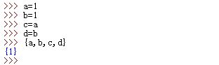
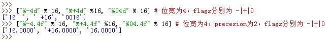
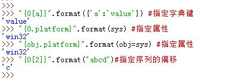
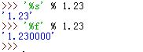

# 集合

## 一、Set 类型

1. Python的`set`类型是集合内元素值唯一、元素值不可变的无序集。`set`类型并不要求其集合内各个元素都是相同类型。  

  -  唯一：`set`类型的集合内元素的值唯一。
     - 如果有两个变量指向同一个对象，则在`set`集合内只会出现一次
     - 如果有两个对象值相等，则在`set`集合内也只会出现一次
     - 本质上`set`通过元素值的哈希值来判断唯一性  
  -  不可变：一旦创建完毕，则`set`集合内的各个元素值不能修改。
     - `set` 集合的元素不能是可变对象（如列表，集合，字典等）
       

2. `set`本身的性质有：

  -  `set`对象是可迭代对象
  -  `set`对象可以增长或缩短
  -  `set`对象可能包含各种类型的对象作为元素
  -  创建`set`对象的方法为调用`x=set(iter)`，其中`iter`为任何序列或可迭代对象

3. `set`对象有以下操作：
  -  成员关系：`e in x`(返回`bool`值）
  -  差集： `x-y`（返回新的`set`对象）
  -  并集： `x|y`（返回新的`set`对象）
  -  交集： `x&y`（返回新的`set`对象）
  -  对称差集： `x^y`（返回新的`set`对象）
    >对称差集：并集中去掉交集的那部分
  -  判定x是否是y的超集： `x>y`(返回`bool`值）
  -  判定x是否是y的子集：`x<y`(返回`bool`值） 

  

4. `set`的方法有：

  -  `.add(item)`：向`set`中插入一项，原地修改（返回`None`)。其中`item`为待插入项
  -  `.update(iter)`：求并集，原地修改（返回`None`)。其中`iter`为任何可迭代对象
  -  `.remove(item)`：从`set`中删除一项，原地修改（返回`None`)。其中`item`为待删除项
     - 这里要求 `item` 缺失在`set` 中
  -  `.intersection(iter)`：求交集，返回新的`set`对象。其中`iter`为任何可迭代对象
  > 注意这里与表达式中的`set`交集、并集操作的区别：表达式中的`set`交集、并集操作要求两个对象均为集合

  

5. `set`对象是可迭代的，因此可用于`len()`函数，`for`循环，以及列表解析中，但是因为是无序的所以不支持索引和分片操作。

  

6. Python3中，`set`常量可以用大括号创建：`{1,2,3,4}`等价于`set([1,2,3,4])`。

  -  空`set`必须由`set([])`创建，`{}`为空字典而不是空`set`
  -  Python3中，`set`的字符串表示为`{...}`形式，而不是`set([...])`形式

7. `set`只能包含不可变的对象，因此列表对象、字典对象、`set`对象均不能作为`set`的元素。
  - 元组和字符串可作为`set`的元素

  

8. `frozenset`是`set`的子类型，它与`set`的唯一区别是：`frozenset`对象是不可变的，因此可以作为`set`的元素。

  - 这隐含着：`frozenset` 没有`.add(x),.remove(x),.update(x)` 等可以原地修改本对象的方法

  

9. `set`的解析构造（在Python3之后）：`{x**2 for x in iter}`，其中`iter`为任何可迭代对象。 

  

##二、字符串

###2.1 基本用法

1. Python的字符串是一种不可变序列，它包含的字符存在从左到右的位置顺序。  

  - 不可变是指：字符串创建以后无法修改它的内容。

  - 序列包括：字符串、列表、元组

2. 字符串由一对双引号或者单引号包围，二者无任何区别

3. 如果希望字符串中包含引号，则有两种办法：

  - 最外围的引号和字符串中的引号使用不同的格式。如`"who's name is Tex?"`
  - 采用转义字符。如`who\'s name is Tex?'`

4. 空字符串是一对引号之间不包含内容：`""`

5. Python自动在任意的表达式中合并相邻的字符串常量

6. 在字符串中反斜杠代表转义序列，每个转义序列代表一个字符（不一定能够打印出来）：

  - `\\`转义反斜杠本身
  - `\n`为换行符
  - `\0`为`\0x00`（不是字符串结尾）
  - `\xhh`为十六进制值
  - `\o00`为八进制值
  - `\uhhhh`为16位Unicode的十六进制值
  - `\Uhhhhhhhh`为32位Unicode的十六进制值
  - Python中`\0`并不去结束一个字符串，Python会在内存中保持整个字符串的长度和文本
  - Python会以十六进制显示非打印的字符
  - 若无合法的转义编码识别`\`以及之后的字符，则Python会在最终的字符串中保留`\`

  

7. raw 字符串是一种特殊的字符串。当`r`出现在字符串起始引号之前时，为 raw 字符串。这种字符串会关闭转义机制。 

  -  raw 字符串不能以`\`结尾。  

   

8. 字符串块：以三重引号包围的字符串（引号为一对单引号或者一对双引号均可）。  

   - 三重引号之间的文本会被收集到一个单独的多行字符串中，并且将换行以`\n`代替。

9. 字符串可以有以下操作：

  - 加：两个字符串相加，返回一个新的字符串
  - 乘：字符串与整数`N`相乘，返回一个新的字符串，该字符串是原字符串重复`N`次
  - `len()`：返回字符串长度
  - 迭代：字符串对象是一个可迭代对象

  

10. 字符串是不可变序列，因此不能原地修改一个字符串，只能够生成新的字符串并赋值给原变量。

  

11. 由于Python内部会暂存并重复使用短字符串来进行优化，因此该短字符串在内存中只有一份。 

   

###2.2 字符串索引

1. 字符串支持索引，其中`S[i]`获取的是偏移为`i`处的字符（偏移`i`从0开始，小于等于`len(S)-1`）。  

  - 若偏移`i`大于`len(S)-1`则Python会抛出`IndexError`异常，提示`string index out of range`
  - 你也可以提供一个负的偏移，其中`-1`为最后一个字符，`-n`为`len(S)-n`处的字符。 

  

2. 字符串支持分片，语法为`S[m:n]`，它返回从`m`开始到`n`（不包含`n`）的一个新字符串。

  - 未给出上界时，该分片默认上界为`len(S)`
  - 未给出下界时，该分片默认下界为 0
  - 如果是`S[:]`，则返回字符串`S`的一个全新拷贝

3. 如果增加步进参数，则语法为`S[m:n:k]`，它返回从`m`开始到`n`（不包含`n`）且每隔`k`个元素选取一次的一个全新字符串，默认`k`为 1。

  - 若`k`为正数则从左到右步进；若`k`为负数，则从右向左步进
  - `S[::-1]`返回S的翻转字符串
  - 负步进时，默认的上下界极限有所不同。
    - 上界极限可以为空或者为`len(S)`或者为`len(S)-1`
    - 下界极限必须为空，否则 0 号元素会被排除掉

  

###2.3 字符串转换

1. 可以通过`str()`函数与`repr()`函数将数字转成字符串。

  - `str()`函数的效果类似`print()`的效果
  - `repr()`函数产生的结果可以由解释器解释。`eval(repr(x))`会返回`x`。
  - 二者区别：
    - `str(x)` 等价于调用 `x.__str__()` 方法
    - `repr(x)` 等价于调用 `x.__repr__()` 方法
    - 这两个方法都返回的是字符串类型。但是通常`__str__`方法返回的是便于用于理解的字符串。而`__repr__` 方法返回的是便于程序员调试的字符串。

  

2. 可以在单个字符与它对应的 ASCII 码值（或者 UNICODE 码值）之间转换：

  - `ord(char)`：返回单个字符的 ASCII 值（或者 UNICODE 码值）
  - `chr(ascii_int)`： 返回 ASCII 值（或者 UNICODE 码值）对应的字符

  

###2.4 字符串格式化

1. 字符串格式化表达式是基于C语言的printf格式化表达式。其格式为：

  ```python
  "%d %s apples" % (3,'bad')
  ```

  它返回一个新的字符串。

2. 占位符有多种：  

  - `%s`：字符串；
  - `%r`：也是字符串，但用`repr()`得到的而不是`str()`；  
  - `%c`：字符；
  - `%d`：十进制整数；
  - `%i`：整数；
  - `%e`：浮点指数；  
  - `%f`： 浮点十进制；
  - `%%`：百分号 `%`；
  - `%g`：自动转成浮点`%e`或者`%f`  

   

3. 转换通用目标结构为：`%[(key_name)][flags][width][.precision]type`

  - `key_name`：用于从右边字典中取对应键的值（此时右边的是字典对象，而不是元组）
    如：`"%(n)%d %(x)%s"%{"n":3,"x":"apples"}` 

  - `flags`：如果为`-`则左对齐；如果为`+`则为正负号；如果为`0`：则补零

  - `width`： 指定位宽（包括小数点在内），至少为`width`字符宽度

    - 如果结果的宽度不足，则根据`flags` 指定的填充方式填充/或者对其方式对齐（默认右对齐）
    - 如果结果的宽度超过，则不进行填充（`flags=0`无效）/也不进行左右对齐（`flags=-`无效）

  - `precision`：指定小数点后几位

    > `width`和`precision`可以为`*`，表示它们从输入的下一项中取值（即从元组中取得）

  - `type`为类型，如`d`,`r`,`f`,`e`等  

    

4. 格式化字符串除了使用字符串格式化表达式之外，还可以通过字符串的`.format()`
  方法达到同样的效果。

  - `.format()`方法支持位置参数、关键字参数、以及二者的混合。
    - 位置参数： `"{0},{1},{2}".format('abc','def','ghi')`
    - 关键字参数：`"{k1},{k2},{k3}".format(k1='abc',k2='def',k3='ghi')`
    - 混合使用：`"{0},{1},{k}".format('abc','def',k='ghi')`  

  

  - 格式化字符串中可以指定对象的属性、字典键、序列的索引：
    - 指定字典的键：`"{0[a]}".format({'a':'value'})`。注意这里的键`a`并没有引号包围
    - 指定对象的属性：`"{0.platform}".format(sys)`，也可以用关键字参数：
      `"{obj.platform}".format(obj=sys)`
    - 指定序列的索引：`"{0[2]}".format("abcd")` ，这里只能进行正索引值，且不能分片 

  

  - 通用格式化结构为： `{fieldname!conversionflag:formatspec}`
    - `fieldname`为位置数字 0,1,2,... 或者为关键字，它后面可选地跟随
      - `.name`：则指定对象的属性
      - `[index]`：指定了索引
      - `[key]`：指定了字典的键

    - `conversionflag`为转换标记，可以为：
      - `r`：在该值上调用一次`repr()`函数
      - `s`：在该值上调用一次`str()`函数
      - `a`：在该值上调用一次`ascii()`函数

    - `formatspec`为格式，其结构为：
       `[[fill] align] [sign] [#] [0] [width] [.precision] [type]`

      - `fill`一般与`align`为`=`时配合

      - `align`为对齐：
        - `<`：左对齐
        - `>`：右对齐
        - `=`：必须指定`fill`（单个字符），此时用这个字符填充
        - `^`：居中对齐

      - `sign`：为正负号标记

      - `#`：作用未知

      - `0`：补0。注意，它不能和 `fill` 同时指定，如果同时指定，则视作一个普通字符串，而不是格式化字符串。

      - `width`：位宽

      - `.precision`：精度

      - `type`：为类型，如`d`,`r`,`f`,`e`等，
          但与格式化字符串表达式相比，多了`b`（二进制格式输出）  

          

    - 某些值可以从`.format()`的参数中获取，如`"{0:+0{1}d}".format(128,8)`，
      其指定精度信息从`format()`的参数中取(参数8)

5. 格式化单个值比较简单，可以有以下方法：

  - `"%s" % 1.23`
  - `"%s" % (1.23,)`，这里`(1.23,)`是一个单元素元组，而`(1.23)`是一个表达式
  - `"{0}".format(1.23)`

6. 浮点数格式化时，采用`%s`说明符与`%f`说明符，其结果不同： 

  

  因为按照`%f`格式化输出时，浮点数有精度和位宽的设定（虽然这里没有显式指定，但是它们有默认值）。而`%s`格式化输出时，首先调用了`str()`函数，然后再进行输出。

##三、列表

1. 列表可以包含任何种类的对象。它是本身是一种可变对象，支持原地修改。
  > 不可变对象有元组、字符串、`frozenset`

2. 列表的基本操作有：

  - `list1+list2`：列表相加合并生成新的列表。该操作并不会修改`list1`和`list2`的值

  - `list1*5`： 列表乘以数字生成重复的新列表，该操作并不会修改`list1`的值
     

  - `item in list1`： 返回元素`item`是否在列表`list1`中 

  - 用于迭代，该操作并不会修改并不会修改`list1`的值：

    ```python
    for item in list1:
    	pass
    ```

  - 列表解析，用于生成列表： `[item*4 for item in iter_obj]`

  - `list()`构造 ：`list(iter_obj)`生成新列表  

    

  - 索引和分片：
    - `list1[index]`：索引，获取指定偏移处的对象。该操作并不会修改并不会修改`list1`的值：
    - `list1[index1:index2]`：分片，返回一个新列表，其元素值与旧列表对应片段处元素值相等。该操作并不会修改并不会修改`list1`的值：

  - 索引赋值和分片赋值：

    - 当索引位于赋值左侧时，则是索引赋值。这会改变列表指定项的内容。该操作会修改`list1`的值
    - 当分片位于赋值左侧时，则是分片赋值。这会改变列表指定片段的内容。该操作会修改`list1`的值
    - 被赋值的片断长度不一定要与赋值的片断长度相等

  

3. 列表的方法调用有：

  - `.append(val)`方法：在列表之后追加元素。原地修改
  - `.sort(key=None, reverse=False)`方法：对列表进行排序。原地修改

     - `key`为一个排序方法，通常可以使用一个 `lambda` 表达式
     - `reverse`为是否逆序
  - `.reverse()`方法：原地翻转列表。原地修改
  - `.extend(iter_obj)`方法：在列表末端插入多个元素，元素从可迭代对象`iter_obj` 中获取。原地修改
  - `.pop()`方法：删除末尾元素并返回该元素。原地修改
    - `.pop(index)`方法：删除指定位置元素并返回该元素。原地修改
  - `del list1[0]`函数：删除指定位置处元素。原地修改

     > 与`.pop()`的区别在于`del()`函数并不返回该元素

  - `del list1[index1:index2]`函数：删除指定片断处元素。原地修改
  - `.remove(val)`：通过值删除元素，若有多个值，则只删除第一个遇到的值。原地修改
  - `.insert(index,val)`：在指定位置插入元素。原地修改
  - `.index(val)`：返回指定元素的位置，**若有多个值，则只返回第一个遇到的值所在位置；如果没有该值，则抛出异常**

  
  

4. 列表相关的内置函数：

  - `sorted(list1,key=None,reverse=False)`：排序列表并返回新列表。不修改 `list1`

  - `reversed(list1)`：返回迭代器，该迭代器迭代结果就是列表的逆序  

    

5. 列表不允许引用超出列表末尾的索引。  

  

6. 列表解析表达式：通过对可迭代对象迭代生成的项运行一个表达式的方式创建一个新列表。如：
  `[c*2 for c in "apple"]`

7. `list(iter_obj)`可以通过可迭代对象`iter_obj`生成一个新列表

8. 假设`L=[1,2]`，注意下面的用法的区别：

  - `X=L*2`：列表乘以整数，生成新列表`[1,2,1,2]`
  - `Y=[L]*2`：也是列表乘以整数，但是被乘列表是`[[1,2],]`，
    生成的新列表是`[[1,2],[1,2],]`
  >列表元素为可变对象时注意，这里改变`L`会影响`Y`，因为`Y`持有`L`的引用

  

9. 如果列表的元素是可变对象的，则对该可变对象的修改会影响到列表。  

   

##四、元组

1. 元组是由圆括号包围的一系列项，它由任意对象元素组成。它本身是不可变的，即不可以原地修改。
  >`set`与`tuple`相反，`set`是本身可变，但是其元素不可变。

2. 元组的基本性质：

   - 元组的元素可以为可变对象，也可以为不可变对象。
   - 元组是有序的序列
   - 元组中的元素可以通过偏移访问，支持索引和分片，但是不支持索引赋值和分片赋值
     - 通过索引访问返回一个值
     - 通过分片访问返回一个新的元组

3. `()`为空元组，`(0,)`为单元素元组（注意逗号`,`），`(0)`为括号表达式

4. 元组的基本用法：

   - `tuple(iter_obj)`函数从一个可迭代对象生成元组

   - `len(tuple1)`：该函数获取元组长度

   - `item in tuple1`：判断元素值`item`是否在元组中

   - 元组是一个可迭代对象，它支持迭代：

     ```python
     for item in tuple1:
     	pass
     ```

5. 元组的方法：

   - `.index(val)`方法：在元组中搜索`val`值所在位置。**若有多个值，则只返回第一个遇到的值所在位置；如果没有该值，则抛出异常**
   - `.count(val)`方法：在元组中累计`val`值出现的次数

   

6. 在不会引起语法冲突的情况下，Python支持忽略元组中的圆括号。如`x=10,20`等价于`x=(10,20)`

##五、字典

1. 字典是一些 "键 --- 值" 对的无序集和。它通过键来索引。

   - 字典是可变对象，它的元素的值的类型不限，它的元素的键类型是不可变类型
     - 意味着键类型不能是列表、`set`、字典

2. 字典的常量表达式：`{'a':3,'b':4}`，空字典的常量表达式为`{}`

3. 创建字典：

   - `dict()`函数可以从关键字参数生成字典：`dict(a=3,b=4)`生成字典`{'a':3,'b':4}`

     - 你可以通过`zip()`函数生成关键字参数：`dict(zip(['a','b'],[3,4]))`
       生成字典`{'a':3,'b':4}`
     - 注意这里关键字不能是表达式（如数字，字符串）。因为这是关键字参数的约定

   - 你也可以用字典的`.fromkeys()`类方法生成字典：

     - `dict.fromkeys(['a','b'])` 生成字典`{'a':None,'b':None}`
     - `dict.fromkeys(['a','b'],3)` 生成字典`{'a':3,'b':3}`

     

4. 字典基本用法：

   - 字典索引：`d[key]`。字典索引返回对应的值

   - 键测试：`key in d`。测试指定键是否存在字典中

   - 字典的迭代：

     - `d.keys()`：返回一个dict_keys对象，它是一个可迭代对象，迭代时返回键序列
     - `d.values()`：返回一个dict_values对象，它是一个可迭代对象，迭代时返回值序列
     - `d.items()`：返回一个dict_items对象，它是一个可迭代对象，
       迭代时返回元组`(键，值)`的序列

     > 字典迭代在Python3中返回可迭代对象，在Python2.7中均返回列表。 因此在Python3中如果想得到列表，必须将返回值传入`list()`函数中得到列表

   - 字典的拷贝：`d.copy()`。只是字典的浅拷贝

   - 获取键的值：通过`d.get(key,default_value)`。返回键对应的值，  若键不存在则返回
     `default_value`

     - 对于`d[key]`返回对应的值，如果`key`不存在则抛出`KeyError`异常

     

5. 字典的操作：

   - `d1.update(d2)`：合并两个字典。原地修改`d1`字典
   - `d.pop(key)`： 从字典中删除`key`并返回该元素的值。原地修改`d`字典
   - `del d[key]`：从字典中删除`key`但是不返回该元素的值。原地修改`d`字典
   - `d[key]=value`：原地的添加/修改字典。当向不存在的键赋值时，相当于添加新元素。原地修改`d`字典


   - 获取字典中元素数量：`len(d)`。它也等于键列表/值列表的长度  

     

6. 字典本身也是一个可迭代对象，它的迭代方法为：

   ```python
   for key in d:
   	pass
   ```

     它在列表的键上迭代，也等价于

   ```python
   for key in d.keys()
   	pass
   ```

    

7. Python3中字典的变化：

   - `d.keys()`、`d.values()`、`d.items()`返回的是可迭代对象，他们称为视图对象，而不是列表。修改字典，则这些视图对象会相应变化

   - 支持字典解析表达式来生成字典，如 `{k:v for k,v in zip(['a','b','c'],[1,2,3])}`，
     `{k:v for k,v in [('a',1),('b',2),('c',3)]}`

   - 取消了Python2中的`has_key(key)`方法，而用`key in d`表达式取代

   - Python3中，只有相等不等测试有效，字典的大小比较无效  

      

8. Python3中字典是一个迭代器对象，其迭代结果是返回键序列（其实 python2 中也是如此）

##六、通用序列

1. Python的通用序列包括：字符串、列表、元组。

  - 字符串：不可变对象，元素只能是字符
  - 列表：可变对象，元素类型不限
  - 元组：不可变对象，元素类型不限
  >这里的`可变`指的是能否修改对象，如增加序列元素，修改序列元素等等

2. Python通用序列操作有：

  - 索引操作： `seq[index]`，返回序列在该位置处的值，有越界检查

  - 分片操作： `seq[index1:index2]`：返回一个新的序列，有越界检查

  - 序列加法： `seq1+seq2`：返回一个新序列，包含`seq1`、`seq2`的拷贝

  - 序列乘法： `seq*N`：返回一个新序列，包含`seq`的`N`份拷贝  

    

3. `set`不是序列，它是可变对象，但是元素只能是不可变类型。 

   字典也不是序列，它也是可变对象，其元素的值是不限类型，但是键必须是不可变类型。

4. 三种解析表达式：

  - 列表解析表达式：`[c*4 for c in 'abcd']`生成一个新列表对象，结果为：`['aaaa','bbbb','cccc','dddd']`

  - `set`解析表达式：`{c*4 for c in 'abcd'}`生成一个新`set`对象，结果为：`{'aaaa','bbbb','cccc','dddd'}`（打印顺序不确定）

  - 字典解析表达式：`{c:c*4 for c in 'abcd'}`生成一个新列表对象，结果为：`{'a':'aaaa','b':'bbbb','c':'cccc','d':'dddd'}` （打印顺序不确定） 
    
    注意：并没有元组解析表达式。`(c*4 for c in 'abcd')`返回的是一个生成器对象。  

    

5. Python 3.0 中，`bytearray`字节串类型是可变的

6. 序列的拷贝：

  - 分片表达式能复制序列，但是只能进行顶层拷贝，即浅拷贝

  - 字典的`.copy()`方法能复制字典， 也只能进行顶层拷贝，即浅拷贝

  - 通过`list()`、`tuple()`等构造方法，可以拷贝序列

  - 通过`copy`标准库模块，可以进行深层拷贝  

    - `copy.copy()` ：进行浅拷贝
    - `copy.deepcopy()`：进行深拷贝

    

7. 比较操作时，Python能够自动遍历嵌套的对象，从左到右递归比较，要多深有多深。过充中首次发现的差异将决定比较的结果。  

   

  - 数字通过相对大小比较

  - 字符串从左到右每个字符按照字符的字典序比较

  - 列表和元组从左到右每部分内容都比较

  - 字典通过排序后的`(键，值)`列表比较
    >Python 3.0 中的字典只能进行相等、不等比较

  - 数字与其他类型比较在 Python 3.0 中是错误的  

    

8. 当一个复合对象包含指向自身的引用时（如`L.append(L)`），称为循环对象。当Python在对象中检测到循环时，会打印成`[...]`而不会陷入无限循环。  

   