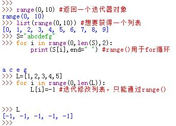
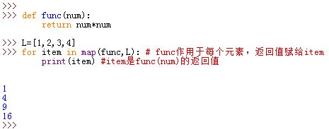

# 基本语法

##一、语句和语法

1. 所有Python的复合语句，都是以冒号`:`结尾，下一行缩进开始进入代码块。同一个级别代码块的缩进形式相同

2. 测试(`if`|`while`)中的一对圆括号`()`是可选的

3. 可以省略行尾的分号`;`

4. 代码块的范围由缩进来决定。同一个块中，所有语句向右缩进相同的距离（块内语句垂直左对齐）。

  - 缩进可以用空格或者制表符。不应该在同一段代码中混合使用制表符和空格
  - 若缩进出现不一致，则会导致语法错误

5. 若将多行语句列入一行，则必须用分号隔离`;`

6. 任何在括号中的多行语句都视为一行。括号包括圆括号`()`，中括号`[]`，大括号`{}`。也可以用反斜线`\`转义换行符来跨多行

7. 当复合语句不包含任何复合从句时，复合语句的主体可以出现在Python首行冒号之后：`if x>y : print(x)`

8. 变量名由：下划线或字母开头，后面接任意字母、数字、下划线

  - 以单下划线开头的变量名不会被`from module import *`语句导入，如变量名`_x`
  - 前后双下划线的变量名是系统预定义的，对解析器有着特殊的意义，如变量名`__x__`
  - 仅前面有双下划线的变量名视为类的本地变量，如变量名`__x`

9. 表达式可以作为语句，但是其结果不会存储。因此只有当表达式工作产生副作用时，这种用法才有意义。

  - 表达式可以作为语句，但是语句不能作为表达式。如 Python中不支持(C和C++可以，因为在C/C++中赋值表达式产生左值）：

    ```python
    if( a=file.read() ):
    	pass
    ```
  - 列表的原地修改表达式返回`None`对象，因此以下的意图不正确：`L=L.append('a')`，会导致`L`为`None`。

10. Python的语句是逐条运行的，除非遇上控制流语句。

  - 块|语句的边界是自动检测的。缩进定义了块边界，换行定义了语句边界
  - 首行、`:`、缩进语句，这三者定义了复合语句
  - 空白行、空格、注释通常被解释器忽略
  - 文档字符串会被解释器忽略，但是会保存它并由工具显示

11. Python顶层程序代码必须不能有缩进。缩进发生在复合语句的字块中。


##二、赋值语句

1. 赋值的左侧可以为变量名或者对象的成员变量，右侧为任何表达式

  - 赋值总是建立对象的引用值，而不是复制对象
  - 变量名会在首次被赋值时创建。此后，每当这个变量名出现在表达式中时，会被它引用的对象所替代
  - 变量名必须先赋值后引用，否则报错
  - 模块导入、函数定义、类定义、`for`循环、函数参数传递 等过程都会触发隐式赋值，原理、规则同显式赋值

2. 赋值语句的形式：

  - 基本形式： `x='abcd'`
  - 元组赋值： `a,b="ab","cd"`，按照位置一一对应赋值
  - 列表赋值： `[a,b]=["ab","cd"]`，按照位置一一对应赋值
  - 扩展的序列解包赋值： `a,*b="abcd"`，结果是 `b`等于`['b','c','d']`
  - 多目标赋值： `a=b="abcd"`

    - 注意此时`a`和`b`都引用同一个对象。如果这个对象是个可变对象，则使用`a`或者`b` 对它进行原地修改可能导致陷阱

  - 增强赋值： `a+='ef'`，等价于`a=a+`ef`

    - 若`a`指向的是可变对象，则`+=`很有可能是原地操作 

      ```python
      a=b=[1,2,3,4] #a,b 指向同一个列表
      a+=[5] #原地操作，现在 a,b 都是指向列表 [1,2,3,4,5]
      b=b+[6] #非原地操作，现在 a 指向列表  [1,2,3,4,5] ； b 指向列表  [1,2,3,4,5,6]
      ```

    -  所有的二元表达式运算符均有增强赋值语句 

  

3. Python3中，元组和列表赋值统一化为序列赋值：`a,b=['ab','cd']`。左侧为任何类型的变量名序列，右侧为任何类型的值序列，只需要变量名序列和值序列长度相等。赋值时根据位置一一对应赋值。

  - 若变量名序列和值序列长度不等，则抛出`ValueError`异常

  - 支持嵌套的赋值序列，Python会自动根据实际情况分解成其组成部分，然后递归赋值。要求左侧变量名序列的嵌套形状必须符合右侧值序列的嵌套形状。  

    

4. 扩展的序列解包赋值：收集右侧值序列中未赋值的项为一个列表，将该列表赋值给带星号`*`的变量

  - 左边的变量名序列长度不需要与值序列的长度相等，其中只能有一个变量名带星号`*`
    - 若带星号`*`变量名只匹配一项，则也是产生一个列表，列表中只有一个元素，如`a,*b="12"`，`b`为`["2"]`
    - 若带星号`*`变量名没有匹配项，则也是产生空列表，如`a,*b="1"`，`b`为`[]`

  - 带星号`*`的变量名可以出现在变量名序列中的任何位置如`*a,b="1234"`，`a`为`["1","2","3"]`

  - 匹配过程优先考虑不带星号的变量名，剩下的才匹配带星号的变量名

  - 以下情况会引发错误：
    - 左侧变量名序列有两个星号，如`*a,*b="abcd"`
    - 左侧变量名序列无星号但是左右长度不匹配，如`a,b="abcd"`
    - 左侧有带星号的变量名，但是左侧不构成一个序列，如`*a='abcd'`

  - 可以用手动分片来模拟扩展赋值行为  

    

5. 增强赋值的优点：

  - `X+=Y`中，`X`可以是复杂的对象表达式，只需要求值一次。而`X=X+Y`中，要对`X`求值两次

  - 对支持原地修改的对象而言，增强形式的赋值会自动执行原地修改的运算：
    - `L=L+[1,2]`会生成新对象
    - `L+=[1,2]`会执行原地修改  

     

##三、打印

1. 打印`print`类似于文件`.write()`方法，它将默认地把对象打印到`stdout`流中。它会自动添加一些自动化的格式。
  - 和文件的`.write()`方法不同的是，`print`不需要将对象转换为字符串

2. 在Python3中，`print`是一个内置函数，用关键字参数表示特定模式，其语法格式为：
  `print(obj1,obj2,sep=' ',end='\n',file=sys.stdout)`，返回值为`None`

  -  参数意义依次为：
    -  待打印对象作为位置参数依次给出
    -  `sep`关键字参数指定分隔符，默认为空格
    -  `end`关键字参数指定结尾字符，默认为换行符
    -  `file`指定输出位置，默认为标准输出文件，它必须是一个写打开的文件对象

  -  每个被打印的对象依次自动通过内置的`str()`函数取得其文本表示

  -  当没有打印对象时，`print()`会把一个换行符（或者由`end`指定的其他字符串）打印到标准输出流中（或者由`file`指定的文件中）

  -  关键字参数可以以任何顺序出现，但必须在位置参数之后

  -  如果想指定对齐或者位宽，则可以先构建格式化表达式来生成字符串，然后再`print`这个字符串  

    

3. Python2中，`print`是语句，有自己的特定语法：`print x,y` 。

   - 如果想指定结尾字符串（默认为换行），则用`print x,y, '\t'` 

4. `print`实际上是向文件对象中写文本字符串，因此对于字符串常量的一对引号实际上是不输出的，它只是输出字符串的内容。而交互式命令中，为了显示指定字符串，输出中带有一对引号。  

  

5. 你也可以用`sys.stdout.write(str(x)+' '+str(y)+'\n')`代替`print(x,y)`  

6. `file`关键字指定的对象可以是文件对象，也可以是拥有`.write()`方法的其他对象

7. 指定默认的`file`关键字参数，也可以通过输出重定向来代替其用法，如
  ```python
  temp=sys.stdout #保存旧值
  sys.stdout=open('test.txt','a') #重新对stdout赋值，该文件对象必须写打开
  print(obj1,obj2)
  sys.stdout.close() #此句可以不要，此时文件对象自动回收，文件自动关闭
  sys.stdout=temp #恢复旧值
  ```

8. 在Python2中，可以通过`from __future __import print_function`使用Python3中的`print()`函数

9. Python3的`input()`直接把输入的文本作为一个字符串返回，不会求值
  （输入什么，字符串中就是什么）。
  - Python2中的`input()`会对字符串求值，就像他们是输入到一个脚本的程序代码一样。
  - Python2 中的 `raw_input()` 的功能与Python3 中的 `input()` 一致。
    - Python2 中的` input()` 就是先调用  `raw_input()` ，然后调用 `eval()` 而已。

   

##四、if 语句

1. `if`语句的的通用格式：
  ```python
  if test_expr1: #必选
  	statement1#必选
  elif test_expr2: #可选
  	statement2
  else: #可选
  	statement3
  ```
  - 注意`if`、`elif`、`else`的缩进一致
  - 除了开头的`if`以及关联的子句外，`elif`、`else`均可选

2. Python中多路分支必须写成一系列的`if/elif`测试，因为Python中没有`switch-case`语句
  - 字典也可以执行多路分支的逻辑，如：
  ```python
  mydict={'a':func1,'b':func2}
  choice='a'
  print(mydict[choice])
  ```

3. Python中的真值测试：

  - 任何非0数字或者非空对象为`True`，数字0、空对象（如空列表，空字典、空元组、空`set`、空字符串）、`None`对象为`False`
    - 数字0不仅包括整数0，还包括浮点数0.0，复数零（0.0+0.0j） 以及其他的数值 0
  - 比较、相等测试会递归地应用在嵌套的数据结构中，他们返回`True`或`False`
  - 布尔`and`和`or`运算符会返回真或假的操作对象，而不是`True`或`Flase`，并且它们是短路计算
    - `and`：从左到右依次对操作对象求值，停在第一个为假的对象上并返回它，或者当前面所有操作对象为真时返回最后一个操作对象
    - `or`：从左到右依次对操作对象求值，停在第一个为真的对象上并返回它，或者当前面所有操作对象为假时返回最后一个操作对象

   

4. Python支持`if|else`三元表达式：`Y if X else Z`：  

  当`X`为真时，表达式的值为`Y`；当`X`为假时，表达式的值为`Z`。
  注意这里为短路计算，并不会同时对`Y`和`Z`求值。

  - 三元表达式`X? Y:Z`也能得到同样的效果
  - 还有一种模拟方法：`[Z,Y][bool(X)]`。但是它会同时对`Z`、`Y`求值，可能会有副作用。

    - `bool(X)`将`X`转换成对应的1或者0

      ```python
      a=bool(0.0)# a 为 False
      print(False==0)# 打印为 True
      ```

      ​

##五、while、for 循环

###5.1 while 

1. `while`语句格式：
  ```python
  while test_expr:
  	statement1
  else:#可选
  	statement2
  ```
  - `while`和`else`缩进必须一致。
  - `else`可选。`else`子句在控制权离开循环且未碰到`break`语句时执行。即在正常离开循环时执行（`break`是非正常离开循环）
  - 在`while`子句中可以使用下列语句：
    - `break`：跳出最近所在的循环到循环外部
    - `continute`：跳过本次循环后续部分，直接掉转到下一轮循环起始处
    - `pass`：占位符，什么都不做

  

2. 在Python3中，允许在使用表达式的地方使用`...`代表，这是`pass`语句的一种替代方案。它表示代码随后填充，是未确定的内容  


###5.2 for 

1. `for`语句格式：
  ```python
  for target_var in iter_obj:
  	statement1
  else:#可选
  	statement2
  ```
  - `for`和`else`缩进必须一致。

  - `else`可选。`else`子句在控制权离开循环且未碰到`break`语句时执行。即在正常离开循环时执行（`break`是非正常离开循环）

  - 在`for`子句中可以使用`break`、`continute`、`pass`语句

  - `target_var`是赋值目标，`iter_obj`是任何可迭代对象。每一轮迭代时将迭代获得的值赋值给`target_var`，然后执行`statement1`

  - 任何赋值目标在语法上均有效，即使是嵌套的结构也能自动解包：

    ```python
    for ((a,b),c) in [((1,2),3),((4,5),6)]:#自动解包
    	print(a,b,c)
    ```

    当然你也可以手动解包：

    ```python
    for both in [((1,2),3),((4,5),6)]:#手动解包
    	((a,b),c)=both
    	print(a,b,c)
    ```

    


3. `for`扫描文件时，直接使用文件对象迭代，每次迭代时读取一行，执行速度快，占用内存少：
  ```python
  for line in open('test.txt'):
  	print(line)
  ```

4. `for`语句通常比对应的`while`语句执行速度快

###5.3 常用循环
1. Python3中，`range()`返回一个迭代器对象。用法为：`range(0,10,2)`，其中`0`为起始数，`10`为终止数（不包含），`2`为步长。默认步长为1，起始为0

  - Python2中，`range()`返回一个列表对象

  - 要得到列表，用`list(range(0,10,2))`

  - 通常`range()`用于`for`循环：

    ```python
    S="abcdefg"
    for i in range(0,len(S),2):
    	print(S[i],end=" "）
    ```
    它也等价于下列循环：

    ```python
    S="abcdefg"
    for c in S[::2]
    	print(c,end=" ")
    ```
    用range()优点是它并未复制字符串      

  - 当我们遍历列表且对其进行修改时，要用到`range()`和`len()`组合。直接用`for`遍历列表不能修改列表，因为`for x in L：`遍历的是列表元素，不是列表中元素的位置。  

    

2. Python3中，`zip()`函数返回一个迭代器对象。
  >Python2中，`zip()`返回一个元组对的列表

  - `list(zip(L1,L2))`创建一个列表，列表元素为元组对，元组对的第一个元素来自于`L1`，第二个元素来自于`L2`，列表长度为`L1`与`L2`的最小值
  - `zip()`可以有两个以上的参数，且这些参数可以是任意的可迭代对象
  - 可以在循环中用自动列表解包：

    ```python
    for x,y,z in zip(iter_obj1,iter_obj2,iter_obj3):
    	pass
    ```
    

3. Python3中，`map()`函数生成一个可迭代对象，用法为：`map(func,iter_obj)`。每一次迭代则在迭代得到的元素上应用函数`func`，`func`执行的结果就是迭代值。
  >Python2中，`map()`执行的是另一种语意

   

4. `enumerate()`函数生成一个可迭代对象，用法为：`enumerate(iter_obj)`。每一次迭代生成一个`(index,value)`元组，`index`表示迭代次数，从0开始计数，`value`代表迭代获得的元素值。

  

## 六、注释和文档

1. `#`是注释符，它之后的文字到行尾均为注释。Python解释器会忽略`#`之后的所有字符

2. `dir(obj)`可以返回对象内所有的属性列表。它能够调用任何有属性的对象
  - 也可以把类型名称传给`dir()`，可以得到相应的结果  

  

3. 文档字符串：对象的`.__doc__`属性。  

  文档字符串是放在模块文件、函数、类定义的顶端，在任何可执行代码之前的字符串。Python会自动封装这个字符串，使其成为相应对象的`.__doc__`属性。

  - 模块文件、函数、类定义的多行注释一般用三重引号字符串

4. 标准PyDoc工具用Python代码编写，它提取文档字符串并自动格式化其信息，展示成排列友好的报表。

  - Python在标准库中附带了PyDoc工具
  - 有两种最主要的PyDoc接口：
    - 内置的`help()`函数。可以对函数、方法、类型、对象使用`help()`函数。 

      对较大的对象（如模块、类型），`help()`输出的内容会分成几段。
      报表中的信息有些是文档字符串，有些是PyDoc自动查看对象内部而收集的结构化信息。

    - PyDoc的 GUI|HTML 接口。启动 `Tools/scripts` 目录下的`pydoc3.py` 脚本：
      `pydoc3.py -b`  

       

5. Python标准手册随Python发布。手册以HTML和其他格式实现。最重要的项目是：

  - Library Reference：标准库文档，说明了内置类型、函数、异常等等
  - Language Reference：官方给出的语言层次的细节

 