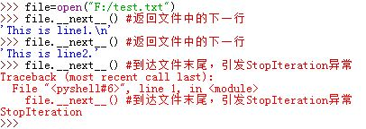
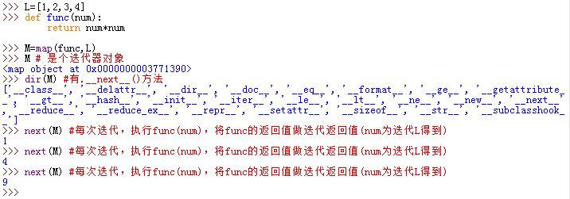
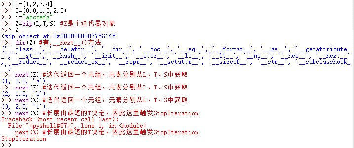
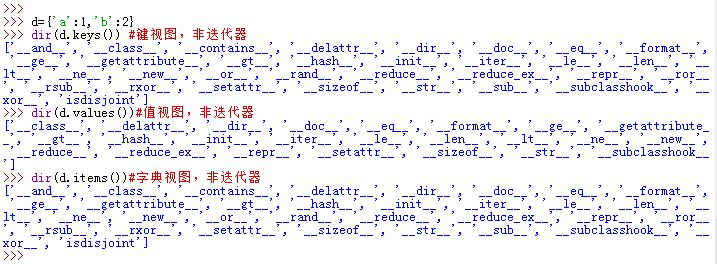
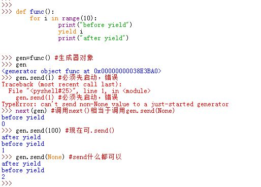

# 迭代

##一、迭代器

###1.1 迭代协议

1. 可迭代对象：在逻辑上它保存了一个序列，在迭代环境中依次返回序列中的一个元素值。
  - 可迭代对象不一定是序列，但是序列一定是可迭代对象

2. 迭代协议：`.__next__()`方法。

  - 任何对象只要实现了迭代协议，则它就是一个迭代器对象

  - 迭代器对象调用`.__next__()`方法，会得到下一个迭代结果

  - 在一系列迭代之后到达迭代器尾部，若再次调用`.__next__()`方法，则会触发`StopIteration`异常

  - 迭代器在Python中是用C语言的速度运行的，因此速度最快  

    

3. Python3提供了一个内置的`next()`函数，它自动调用迭代器的`.__next__()`方法。即给定一个迭代器对象`x`，`next(x)`等同于`x.__next__()`  

   

###1.2 常见迭代器

1. 内置的`iter()`函数用于从序列、字典、`set`以及其他可迭代对象中获取迭代器。

  - 对任何迭代器对象`iterator`，调用`iter(iterator)`返回它本身

  - 迭代器对象实现了迭代协议

  - 文件对象本身是一个迭代器对象。即文件对象实现了迭代协议。每次调用`iter(f)` 返回的是同一个对象（也就是文件对象自己）

    ```python
    f=open("xxx")
    f_iter=iter(f)
    f is f_iter #返回 True
    ```

  - 列表、元组、字典、`set`、字符串等不是迭代器对象，他们没有实现迭代协议。因此每次调用`iter()`均返回一个新迭代器对象。他们支持安装多个迭代器，每个迭代器状态不同
    - 在原地修改列表、`set`、字典时，会实时反映到它们的迭代器上

  

2. 文件迭代器：文件对象本身是一个迭代器（这里文件对象要是读打开）。它的`.__next__()`方法每次调用时，返回文件中的下一行。当到达文件末尾时，`.__next__()`方法会引发`StopIteration`异常。
  > `.readline()`方法在到达文件末尾时返回空字符串

  

3. 字典的迭代器：字典的迭代器在迭代环境中，每次迭代返回的是一个键。  

  

###1.3 迭代环境

1. 扩展的列表解析表达式：`[ x+y for x in 'abc' if x!='a' for y in 'lmn' if y!='l']`  。所谓扩展，就是同时对多个可迭代对象进行迭代，以及支持`if`判断。

  - 其通用结构为：

    ```python
    [ expression for target1 in iterable1 [if condition1] for target2 in iterable2 [if condition2] ....]
    ```

  - 我们总是可以用`for`循环手动构建列表解析表达式的结果，但是列表解析表达式性能更好

  

2. `for`循环、列表解析、`in`成员关系测试、`map()`内置函数、`sorted()`内置函数、`zip()`内置函数等都是用迭代协议来完成工作

3. `for`循环（及其它迭代环境）通过重复调用`.__next__()`方法直到捕获一个异常。若一个不支持迭代协议的对象想工作在这种环境中，`for`循环会尝试使用索引协议迭代。

4. 常见的迭代环境的函数：

  - `map(func,iterable)`：它将函数`func`应用于传入的迭代器的每个迭代返回元素，返回一个新的迭代器，函数执行结果作为新迭代器的迭代值 

    - `map()`可以用于多个可迭代对象：`map(func,[1,2,3],[2,3,4])`，其中`func(first,second)` 的两个参数分别从两个可迭代对象中获取，函数结果作为新迭代器的迭代值 

    

  - `zip(iterable1,iterable2,...)`：它组合可迭代对象`iterable1`、`iterable2`、`...`中的各项，返回一个新的迭代器。新迭代器长度由`iterable1`、`iterable2`、`...`最短的那个决定。  

    

  - `enumerate(iterable,start)`：返回一个迭代器对象，它迭代结果是每次迭代返回一个`(index,value)`元组  

    

  - `filter(func,iterable)`：返回一个迭代器对象，它的迭代结果得到`iterable`中部分元素，其中这些元素使得`func()`函数返回为真  

    

  - `reduce(func,iterable,initial)`：对`iterable`中每一项成对地运行`func`，返回最终值  。

    - `reduce`函数位于`functools`包内

  

  - `sorted(iterable,key=None,reverse=False)`：排序并返回排好的新列表  

    

  - `sum(iterable,start)`：返回可迭代对象中的累加值  

    

  - `any(iterable)`：只要可迭代对象`iterable`迭代的某个元素为真则返回`True`

  - `all(iterable)`：只有可迭代对象`iterable`迭代的所有元素为真则返回`True`  

    

  - `max(iterable,key=func)`：返回最大元素。若指定`func`，则返回是`func(num)`最大的那个元素

  - `min(iterable,key=func)`：返回最小元素。若指定`func`，则返回是`func(num)`最小的那个元素  

    

5. `set`解析、字典解析支持列表解析的扩展语法   

  

6. Python3中，`range`对象不支持`.__next__()`，因此它本身不是迭代器，而`map`、`zip`、`filter`对象都是迭代器。

  - `range`不直接生成列表的优点是节约内存空间

  - 由于`map`、`zip`、`filter`对象都是迭代器，因此不支持在它们身上安装多个活跃的迭代器。对他们调用`iter()`其实返回的是它们本身。  

    

7. 字典的视图：键视图、值视图、字典视图都没有`.__next__()`方法，因此他们都不是迭代器  

  

8. 通常列表解析执行速度最快，`map()`速度次之，`for`循环速度最慢。

  - 前两者以C语言速度执行、后者在Python虚拟机上执行

##二、生成器

###2.1 生成器函数

1. 生成器函数：编写为常规的`def`语句，但是用`yield`语句一次返回一个结果。每次使用生成器函数时会继续上一轮的状态。
  - 生成器函数会保存上次执行的状态

2. 定义生成器函数的语法为：

  ```python
  def genFunc(num):
  	for i in range(num):
  		yield i**2
  ```

3. 生成器函数执行时，得到一个生成器对象，它`yield`一个值，而不是返回一个值。  

  - 生成器对象自动实现迭代协议，它有一个`.__next__()`方法
  - 对生成器对象调用`.__next__()`方法会继续生成器函数的运行到下一个`yield`
     结果或引发一个`StopIteration`异常

4. `yield`语句会挂起生成器函数并向调用者发送一个值。当下一轮继续时，函数会在上一个`yield`表达式返回后继续执行，其本地变量根据上一轮保持的状态继续使用 

5. 生成器函数运行代码随时间产生一系列的值，而不是一次性计算它们。这会节约内存并允许计算时间分散。  

  

6. 生成器函数可以有`return`，它可以出现在函数内任何地方。生成器函数内遇到`return`则触发`StopIteration`异常，同时`return`的值作为异常说明  

  

###2.2 生成器对象

1. 生成器对象有一个`.send(arg)`方法。该方法会将`arg`参数发送给生成器作为`yield`表达式的返回值，同时生成器会触发生成动作(相当于调用了一次`.__next__()`方法。

  - `yield`表达式的返回值和生成值是不同的。  

    - 返回值是用于生成器函数内部，`yield`表达式默认返回值为`None`； 如果想改变该返回值，则必须使用`.send(...)` 方法 
    - 生成值是用于生成器函数外部的迭代返回。  

  - 生成器对象必须先启动，你才能向他`send`一个非空值（空值是可行的，这表示启动生成器对象）。启动意味着它第一次运行到`yield`之前挂起    

    

  - 要想启动生成器，可以直接使用`next(generatorable)`函数，也可以使用`generatorable.send(None)`方法，或者`generatorable.__next__()`方法
    - `next(generatorable)`函数相当于使用`generatorable.send(None)`方法

  - `generatorable.send(None)`方法会在传递`yield`表达式的值（默认为`None`返回值），下一轮迭代从`yield`表达式返回开始
    - 每一轮挂起时，`yield`表达式 yield 一个数，但是并没有返回（挂起了该`yield`表达式）

  

2. 可以调用生成器对象的`.close()`方法强制关闭它。这样再次给它`send()`任何信息，都会抛出`StopIteration`异常，表明没有什么可以生成的了  

  

###2.3 生成器表达式

1. 生成器表达式：类似于列表解析，但是它是在圆括号中的，而不是方括号中的。

  - 生成器表达式返回的是一个生成器对象

  - 列表解析的结果等同于`list()`内参数为一个生成器表达式

  - 当生成器表达式在其他括号之内时，它本身的圆括号可以不写

  - 同样的迭代可以用生成器函数或者一个生成器表达式
    - 生成器函数可以包含更多的逻辑
    - 生成器表达式更简洁，没有函数调用产生生成器的过程
    - 生成器函数与生成器表达式支持自动迭代与手动迭代

  - 生成器对象本身是迭代器，因此只支持一个活跃的迭代器。  

    

###2.4 yield from

1. `yield from`：从`PEP 380`引入的新特性。  

2. `yield from`可以将一个大的生成器切分成小生成器：

  ```python
  def generator(): #该生成器yield数字[0~19]
  	for i in range(10):
  		yield i
  	for j in range(10,20):
  		yield j
  ```
    如果你想切分成两个迭代器，可以这么做：

  ```python
  def generator2():
  	for i in range(10):
  		yield i
  def generator3():
  	for j in range(10):
  		yield j
  def generator():
  	for i in generator2():
  		yield i
  	for j in generator3():
  		yield j
  ```
   引入`yield from`之后你可以这么做：

  ```python
  def generator2():
  	for i in range(10):
  		yield i
  def generator3():
  	for j in range(10):
  		yield j
  def generator():
  	yield from generator2()
  	yield from generator3()
  ```

3. `yield from`能实现代理生成器：

  ```python
  def generator():
  	inner_gen=generator2()
  	yield from inner_gen #为了便于说明，这里分两行写
  gen=generator()
  ```
  - 对`inner_gen`迭代产生的每个值都直接作为`gen` yield值
  - 所有`gen.send(val)`发送到`gen`的值`val`都会被直接传递给`inner_gen`。
  - `inner_gen`抛出异常：
    - 如果`inner_gen`产生了`StopIteration`异常，则`gen`会继续执行`yield from`之后的语句
    - 如果对`inner_gen`产生了非`StopIteration`异常，则传导至`gen`中，导致`gen`在执行`yield from`的时候抛出异常
  - `gen`抛出异常：
    - 如果`gen`产生了除`GeneratorExit`以外的异常，则该异常直接 throw 到`inner_gen`中
    - 如果`gen`产生了`GeneratorExit`异常，或者`gen`的`.close()`方法被调用，则`inner_gen`的`.close()`方法被调用。
  - `gen`中`yield from`表达式求值结果是`inner_gen`迭代结束时抛出的`StopIteration`异常的第一个参数（也就是 `inner_gen` 的显式/隐式 `return` 的值）
  - `inner_gen`中的`return xxx`语句实际上会抛出一个`StopIteration(xxx)`异常，所以`inner_gen`中的`return`值会成为`gen`中的`yield from`表达式的返回值。