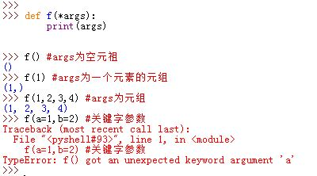
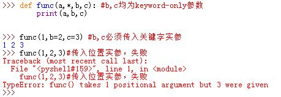
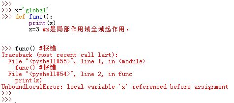

# 函数

##一、函数

1. Python的函数是由`def`语句编写。Python中，函数也是一种对象类型

  - `def`是一个可执行语句。Python执行了`def`语句后函数对象才存在，之前该函数对象不存在
  - Python运行`def`语句时，它将会生成一个新的函数对象，并将该函数对象赋值给这个函数名。函数名成了这个函数对象的引用
  - `lambda`表达式创建一个函数对象并返回它，但是它并没有绑定一个名字。即它是匿名的没有函数名
  - `return`语句将一个结果对象发送给调用者
  - `yield`语句使得函数成为一个生成器
    

2. 函数参数没有任何类型约束，返回类型也没有任何类型约束

3. Python函数定义语句：
  ```python
  def func_name(arg1,arg2):
  	statement
  ```
  在执行完`def`语句时，Python创建一个函数对象并将它赋值给`func_name`变量。

  - `return`语句是可选的。若无`return`，则默认自动返回`None`对象
  - `def`语句可以出现在任何语句可以出现的地方，甚至是嵌套在其他语句中。
  - 与C语言不同，Python函数在程序运行之前不需要全部定义。`def`在它定义的地方时才评估，而`def`的之内的代码在函数调用的时候才求值。 
    

4. 函数仅仅是对象类型，函数名也仅仅是变量名，它们没有任何特殊之处。

  - 函数对象有函数调用方法`operator ()`
  - 函数对象允许任意的属性添加`func.attr=value` 
     

5. 函数主体内的代码直到函数被调用时才运行。函数内的变量名在函数实际执行之前都不会解析。

##二、参数

###2.1 基本用法

1. 参数传递的性质：

  - 参数的传递是通过自动将对象赋值给本地变量名来实现的（自动的隐式赋值）
    - 被传递的参数对象本身并不会被拷贝
  - 在函数内部的参数名赋值不会影响到实参对象，只是将变量名重新引用到另一个对象
  - 若实参对象为可变对象，则在函数内原地修改参数对象会影响所有的指向该实参对象的引用
    - 可变参数实参对象对函数来说，既可以作为输入也可以作为输出
    - 如果想限制对可变实参对象的修改，可以创建一个可变对象的拷贝作为参数；或者直接转换成不可变对象作为参数

  

2. 默认情况下，函数调用时，参数匹配是通过其位置进行匹配的，从左到右一一匹配。必须精确传递和函数签名中参数名一样多的实参。

3. 关键字参数：函数调用时，允许通过变量名进行匹配，而不是通过位置。其中关键字顺序可以任意。 
   

4. 默认参数：函数定义时，可以为参数设定默认值，这样允许调用时传递较少的参数。
  - 对于默认实参，可以不用给它传入实参
  - 默认实参后面不能跟随非默认实参。如果出现这种情况则报语法错误。 


  

5. Python在内部会将每个默认实参保存成对应的对象，附加在这个函数本身。在不同的函数调用期间，这些默认实参会保存同一个对象。因此对于可变对象作为默认实参注意保持警惕。 
    

###2.2 可变参数

1. 在函数定义时，函数能用特定的参数（以`*`开头），收集任意多的额外位置参数，将收集到的位置相关的参数到一个新元组中。

  - 若出现了额外的关键字参数，则报错。额外的意思是：无法和签名匹配的那些关键字参数

      

2. 在函数定义时，函数能用特定的参数（以`**`开头），收集任意多的额外关键字参数，将收集关键字相关的参数到一个新字典中。

   - 若出现了额外的位置参数，则报错。额外的意思是：无法和签名匹配的那些位置参数

       

3. 可变参数解包：在函数调用时：

  - 调用者可以用`*`语法将实参（如元组、列表、`set`）打散，形成位置参数
  - 调用者可以用`**`语法将字典实参打散，形成关键字参数  
  >这里的`*`和`**`均是在函数调用中出现，而不是在函数定义中出现

    

4. `keyword-only`参数：在Python3中，它出现在`*`参数之后，在`**`参数之前。所有的`keyword-only`参数必须使用关键字语法来调用。
  >如果不这么做，则没有办法传递该实参

  

  ​

5. 定义函数时，形参列表中`*`可以单独出现。此时函数并不表示接受一个可变长度的实参列表，而是表示`*`后面的所有实参必须作为关键字实参传入：

   > 并不能用`**`像`*`一样单独出现在函数定义中。 

   

###2.3 参数组合

1. 函数调用时，位置参数与关键字参数可以组合

  - 不能为同一个形参同时指定位置实参与关键字实参
  - 任何关键字实参必须位于任何位置实参之后 
    

2. 函数定义时的参数类型顺序：

  ```python
  def func(a,b,c='c',*d,e,f='f',**g):
  	pass
  # a,b:为一般参数
  # c:指定了默认实参
  # d:为可变位置参数
  # e,f:为 keyword-only参数，其中f指定了默认参数
  # g:为可变关键字参数
  ```
  - 调用时必须先赋值形参`c`，才能进入`d`。无法跳过`c`去赋值`d`
  - `e,f,g`调用时必须都是关键字实参

3. 函数调用时实参类型顺序：
  ```python
  func('a','b',e='e',*seq,**dic)
  #seq是一个序列，它解包之后优先覆盖c，剩下的再收集成元组传给d
  #dic是一个字典，它解包之后优先考虑e,f，剩下的在收集成字典传递给g
  #e='e'这个关键字实参也可以位于'b'之后的任何位置
  #关键字实参必须位于位置实参之后
  ```
   

  - 通过位置分配位置参数
  - 通过匹配变量名在分配关键字参数
  - 额外的非关键字参数分配到 `d`引用的元组中
  - 额外的关键字参数分配到`g`引用的字典中
  - 默认值分配给剩下未赋值的参数

  Python最后检测确保每一个参数只传入了一个值

##三、作用域

1. 代码中变量名被赋值的位置决定了这个变量名的作用域（即可见范围）。因为变量是在首次赋值的时候定义的。

  -  Python将一个变量名首次被赋值的地点关联为一个特定的命名空间

###3.1 三种作用域

1. 变量可以在3个不同的地方定义，对应三种不同的作用域：

  -  `def`内赋值定义的变量：作用域为本函数
     - 这里的赋值包括显式`=`赋值和隐式赋值。隐式赋值包括
       - `import`语句隐式赋值
       - `def`函数定义来隐式赋值（函数名这个变量）
       - 形参匹配来隐式赋值
  -  嵌套的`def`中赋值定义的变量：对于父函数来说，该变量不是本地的
  -  `def`之外赋值，作用域为整个文件全局的 
    

###3.2 作用域法则

1. 作用域法则：

  -  每个模块文件就是一个全局作用域。从外面看，模块的全局变量就成为该模块对象的属性；从内部看，模块的全局变量就是普通的、作用域为全局的变量
  -  全局作用域的范围仅限于变量所在的单个文件
  -  每次调用函数，都创建一个新的局部作用域
  -  默认情况下，所有函数定义内部的变量都是局部变量
    -  `global`语句声明会将变量名作用域提升至全局
    -  `nonlocal`语句声明会将变量名作用域提升至外层的`def`
  -  Python预定义的`_builtin_`模块提供了一些预定义的内置变量 
    

2. 交互式运行的代码实际上位于`__main__`的内置模块中

3. Python是静态检测局部变量的：

  ```python
  x='global'

  def func():
  	print(x)
  	x=3
  ```

   编译时，Python看到了赋值语句`x=3`，因此决定了在函数内的任何地方，`x`都是本地变量。但是`print(x)`时赋值语句并未发生，此时即使全局中有全局的`x`，也会报错。

  - 任何在函数体内的赋值、`import`，嵌套`def`，嵌套类等都受这种行为影响

    - 即只要有局部变量的定义，无论在函数内哪个地方，其作用域都是本局部作用域全域

    

###3.3 LGBE

1. 变量名查找规则：`LGBE`

  -  首先查找本地作用域`L`

  -  接着查找上一层`def`或`lambda`的本地作用域`E`

  -  接着查找全局作用域`G`

  -  最后查找内置作用域`B`

  -  如果均未找到变量名则报错。 

     > 如果是赋值，则直接在当前作用域内定义了一个变量

  ```python
  a=1
  b=2
  def func():
  	global a,b,c #一个名字或逗号分隔的多个名字，这些变量名被提升到全局作用域内
  	a=2
  	b=0
  	c=0 #虽然c没有在def外定义，但这里的global 和 c=0会在全局作用域内定义c
  ```
    

2. 当前面作用域的变量名覆盖内置的作用域名字时，可以手动`import builtins`模块，再用`builtins.name`来直接使用这个变量名。

  - 注意不要随意修改`builtins`模块内变量的值。

3. 要在局部作用域中修改全局变量，方法有以下几种：

  -  global声明
  -  通过`import modname`然后利用`modname.attr`来访问
  -  通过`import sys`然后利用`sys.modules['modname'].attr`来访问 
    

4. 作用域示例：
  ```python
  x='global_x'          #全局作用域
  def f1():             
  	x='f1_x'            #f1的局部作用域
  	z='f1_z'            #f1的局部作用域
  	def f2():
  		global y      #全局作用域
  		y='f2_y'
  		print('in f2',x) #LGBE法则，找到的是f1局部作用域中的x
  		nonlocal z    #f2的nonlocal作用域，是f1的局部作用域
  		z='f2_z'
  		t='f2_t'      #f2的本地作用域
  	f2()
  ```
  

###3.4 闭包

1. 嵌套的函数返回后也是有效的。

  ```python
  def f1():
  	x=99
  	def f2():
  		print(x)
  	return f2 # f2是个局部变量，仅在f1执行期间因为新建了局部作用域所以才存在。
  action=f1() #f2指向的函数对象，由于action引用它，因此不会被收回。
  #但是f2这个位于局部作用域中的变量名被销毁了
  action() #此时f1执行结束，但是f2记住了在f1嵌套作用域中的x。这种行为叫闭包
  ```
  >类比闭包在语义上更明确，因为类可以明确定义自己的状态

  

2. 在函数内部调用一个未定义的函数是可行的；只要在函数调用时，该未定义函数已定义即可。 
  

3. 嵌套作用域中的变量在嵌套的函数调用时才进行查找，而不是定义时。
  ```python
  def func():
  	acts=[]
  	for i in range(5):
  		acts.append(lambda x:i**x) #添加匿名函数对象
  	return acts
  acts=func()
  acts[0](2) #调用时才开始查找i,此时i最后被记住的值是4
  ```

  

  要解决这个这个陷阱，可以用默认参数：
  ```python
  def func():
  	acts=[]
  	for i in range(5):
  		acts.append(lambda x,i=i:i**x) #每次循环，形参i的默认实参均不同
  	return acts
  acts=func()
  acts[0](2) 
  ```

###3.5 nonlocal

1. `nonlocal`是Python3中引入的。

  ```python
  def func():
  	a=0
  	b=1
  	def func1():
  		nonlocal a,b#限定了查找只能在func1 本身所在的作用域（即func的本地作用域），且要求名字a,b已经存在。
  		a='a' #对a,b的赋值会影响到func中的a,b
  ```
  -  如果没有`nonlocal`，则在`func1`中的赋值会创建本地变量，而无法修改`func`中的局部变量
  -  `global`使得作用域查找先从全局作用域开始，跳过了局部作用域以及`nonlocal`作用域。
  -  Python在函数创建的时候解析`nonlocal`，而不是在函数调用时，因此要求`nonlocal`的名字已经存在

2. 全局变量、`nonlocal`变量、类、函数属性都提供了状态保持能力

3. `global`、`nonlocal`只是修改了变量作用域（即作用域提升），但是并未给出变量定义  

   

##四、高级特性

1. 在Python中，函数的递归通常比`for`循环要慢而且空间消耗大，但是递归的优点是可以遍历任意形状的结构。

###4.1 函数对象

1. Python函数是对象，自身存储在内存块中，它可以自由地传递与引用。

2. 函数对象支持一个特殊操作：有括号`()`以及参数列表执行调用行为

3. 我们可以通用地检查函数对象的某些属性：如`.__name__`属性、`.__code__`属性

4. 可以向函数对象附加任意的用户自定义属性，如`func.count=0`。这样的属性可以用来直接将状态信息附加到函数对象上

5. Python3中，可以给函数对象附加注解。注解不作任何事情，而且注解是可选的，它被附加在函数对象的`.__annotaions__`属性中。注解的格式为：

    ```python
    def func(a:'a',b:(1,10),c:float) -> int:
    	return a+b+c  
    ```
    - 注解分两种：
      - 参数注解紧随形参名字的冒号`:`之后；
      - 返回值注解紧随参数列表的`->`之后
    - 当出现注解时，Python将它们收集到字典中并附加到`.__annotations__`属性中
    - 注解可以与默认值同时出现，此时形参形式为`c:float=4.0`
    - 注解只有在`def`中有效，在`lambda`表达式中无效

    

###4.2 lambda 表达式

1. 匿名函数：`lambda`表达式创建了一个函数对象，它返回该函数对象而不是将其赋值给一个变量名。 

2. 创建`lambda`表达式的语法为：

    ```python
    lambda arg1,arg2,...argN: expression using args
    ```

3. `lambda`表达式是个表达式而不是语句，它能出现在不允许`def`出现的某些地方，比如参数中

4. `lambda`表达式返回一个值（一个新的函数对象），可以将它手动赋值给一个变量名

    - `def`总是将一个新的函数对象自动赋值给一个变量名（函数名）

5. `lambda`的主体是一个单一的表达式，而不是一个代码块。因此`lambda`通常比`def`功能简单

    - `lambda`内部甚至不能使用`if`语句


    - `lambda`主体中表达式的值就是调用时的返回值，不需要显式`return`

6. `lambda`表达式也能使用默认实参

7. `lambda`表达式主体中遵循`def`内一样的名字作用域查找法则 
    

8. 出于可读性要求，最好不要嵌套使用`lambda`表达式

9. `lambda`表达式应用于`map()`、`filter()`、`reduce()`等函数中较多
