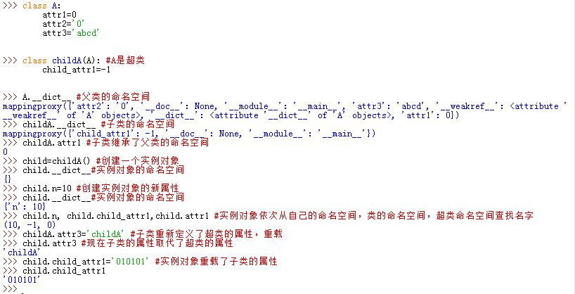

# 类 class

##一、class

###1.1 class & instance

1. Python中，类`class`与实例`instance`是两种不同的对象类型

  - `class`对象是`instance`对象的工厂
  - `class`对象与`instance`对象都有各自独立的命名空间
  - `class`对象来自于`class`定义语句，`instance`对象来自于函数调用语句
  - `instance`对象可自动存取`class`对象中的变量名

2. 创建类对象：
  ```python
  class class_name:
    name1=val
    def method(self):
      pass
  ```
  - `class`语句类似于`def`语句，也是可执行语句。执行时会产生新的`class`对象，并将该`class`对象赋值给变量名（即类名）

  - `class`语句内的顶层赋值语句会创建类的属性。`class`语句创建的作用域会成为类属性的命名空间
    > 如果是`class`内的`def`中的赋值语句，则并不会创建类的属性

  - 类属性为所有的`instance`对象提供状态和行为，它是由该类创建的所有`instance`对象共享的

3. 与C++不同，Python的`class`语句是一个可执行语句，且是隐式赋值的。

4. 类可以有文档字符串。文档字符串是位于各种结构顶部的字符串常量。

  - 文档字符串在运行时能保持
  - 可以通过`.__doc__`属性获取 
    

5. 创建实例对象：
  ```python
  instance_name=class_name()
  ```
  - 像函数那样调用类对象会创建新的实例对象。
    - 每次调用时，均会返回新的实例对象
    - 每个实例对象都有自己的命名空间。同一个类的实例对象不一定属性都相同
  - 每一个实例对象继承类的属性并创建了自己的命名空间
    - 类创建的实例对象是有新的命名空间。刚开始该命名空间是空的，但它会继承创建该实例的类对象的属性。
    - 继承的意思是，虽然实例对象的命名空间是空的。但是名字查找会自动上升到类对象的命名空间去查找
  - 在类的方法中，第一个参数（根据惯例称为`self`）会引用调用该函数的实例对象。对`self`的属性赋值，会创建或修改实例对象的属性，而非类的属性。
    - 可以通过方法调用： `instance_name.func()`
    - 也可以通过类调用： `class_name.func(instance_name)`

  


###1.2 属性

1. 可以在`class`语句外创建类对象的新属性，通过向类对象直接赋值来实现。
  ```python
  classA.attr=val
  ```

2. 可以在`class`语句外创建实例对象的新属性，通过向实例对象直接赋值来实现。

  ```python
  a=classA()
  a.attr=val
  ```
  

3. 类对象的 `.__dict__`属性是类对象的命名空间，是一个类字典对象`mappingproxy`对象；

4. 实例对象的 `.__dict__`属性是实例对象的命名空间，是一个字典；  

  > 通过查看它们可以轻易地查看到继承树的各属性  

  

5. 实例对象的`.__class__`属性是它所属的类  

6. 类对象的`__bases__`属性是它超类对象的元组  

7. 类对象的`__name__`属性是类名 

  


###1.3 class 的继承

1. 类可以继承。被继承的类称为超类，继承类称为子类。

  ```python
  class childC (parentC): # childC为子类，parentC为超类
  	pass
  ```

2. 类对象会继承其超类对象中定义的所有类属性名称。

  - 读属性时，若该属性不存在于本类中，Python会自动在超类的命名空间中寻找
  - 写属性时，若该属性不存在于本类中，则会创建新属性（此时仅操作本类的命名空间，而不是继承）

3. 实例对象会继承所有可访问到的类的属性。

  - 读变量名时，Python会首先检查实例的命名空间，然后是类的命名空间，最后是沿继承链查找所有超类的命名空间
  - 写变量时，若该变量不存在于本实例对象中，则会创建新属性（此时仅操作本实例对象的命名空间，而不是继承）

4. 若子类重新定义了超类的变量名（无论是在`class`内部定义，还是在`class`外部通过赋值来定义），子类会取代并定制所继承的行为。这称为重载 
  

5. 在子类中调用超类的方法：`superClass.func(obj,args)`，其中`obj`通常为`self` 
  

6. Python的继承与C++继承不同。在Python中，当对象通过点号运算读取属性值时就会发生继承，而且涉及了搜索属性定义树。

  - 每次使用`name.attr`时(`name`为实例对象或者类对象），Python会从底部向上搜索命名空间树。先从本对象的命名空间开始，一直搜索到第一个找到的`attr`名字就停止
  - 命名空间树中较低位置处的定义会覆盖较高位置处的定义
  - 继承树的搜索仅仅发生在读取属性值的时候。在写属性值时，执行的是属性的定义（当前命名空间中该名字不存在）或赋值（当前命名空间中该名字已存在）语义。

  ~~~mermaid
  graph BT;
  A(实例命名空间)-->B[类命名空间];
  B-->C[超类1命名空间];
  B-->D[超类2命名空间];
  style A fill:#f9f,stroke:#333;
  ~~~
7. 多重继承：子类可以继承一个以上的超类。超类在class语句首行括号内列出，以逗号分隔

  - 子类与其实例继承了列出的所有超类的命名空间
  - 搜索属性时，Python会从左到右搜索class首行中的超类，直到找到匹配的名字


###1.4 持久化

1. 类对象与实例对象都是内存中的临时对象。可以通过对象持久化来把他们保存在磁盘中。

2. `pickle`模块：通用的对象序列化与反序列化工具。它可以将任何对象转换为字节串，以及将该字节串在内存中重建为最初的对象。`pickle`常用接口为：

  - 序列化：
    -  `pickle.dump(obj, file, protocol=None, *, fix_imports=True) `: 将`obj`对象序列化并写入`file`文件对象中
    -  `pickle.dumps(obj, protocol=None, *, fix_imports=True)`：将`obj`对象序列化并返回对应的字节串对象（并不写入文件中） 
  - 反序列化：
    - `pickle.load(file, *, fix_imports=True, encoding="ASCII", errors="strict") `：从`file`对象中保存的字节串中读取序列化数据，反序列化为对象
    - `pickle.loads(bytes_object, *, fix_imports=True, encoding="ASCII", errors="strict")` ：从字节串中读取序列化数据，反序列化为对象

   

3. `dbm`模块：一个可以通过键访问的文件系统.它的键、值都是字节串或者字符串。它以类似字典的方式访问（但是首先要`open`）。 
  

4. `shelve`模块：以上两个模块按照键将Python对象存/取到一个文件中。`shelve`模块提供了一个额外的结构层。允许按照键来存储`pickle`处理后的对象

5. `shelve`模块用法：它用`pickle`把对象转换为字节串，并将其存储在一个`dbm`文件的键之下；它通过键获取`pickle`化的字节串，并用`pickle`在内存中重新创建最初的对象

  - 一个`shelve`的`pickle`化对象看上去就像字典。`shelve`自动把字典操作映射到存储|读取在文件中的对象
    - 一个`shelve`和常规字典用法上的唯一区别：一开始必须打开`shelve`并且在最后关闭它。另外`shelve`不支持`SQL`查询工具
  - 存取语法
    - 存储的语法：

      ```python
      import shelve
      db=shelve.open('filename') #打开
      for obj in objList:
      	db[obj.name]=obj #写入
      db.close() #关闭
      ```
    - 读取的语法:

      ```python
      import shelve
      db=shelve.open('filename') #打开
      for key in db:#像字典一样访问
      	print(key,'=>',db[key]) #读取
      db.close() #关闭
      ```
  - 载入重建存储的对象时，不必`import`对象所属类。因为Python对一个对象进行`pickle`操作时，记录了`self`实例属性，以及实例所属类的名字和类的位置。当`shelve`获取实例对象并对其进行`unpickle`时，Python会自动重新`import`该类。
  - 优缺点：
    - 缺点：`pickle`作用的类必须在一个模块文件顶部编码，且该模块文件可通过`sys.path`找到
    - 优点：当类实例对象再次重建时，对类的源代码文件的修改会自动选取。
      - 这一般发生在两次运行时。若仅仅在一次运行中，则前面已import，再次import无效果

   


##二、命名空间

1. 有点号和无点号的变量名，会使用不同的方式处理

  - 无点号运算符的变量名，使用`LEGB`作用域规则查找名字
  - 有点号运算符的变量名，使用的是对象的命名空间查找名字
  - 模块的作用域以及类的作用域会对对象的命名空间进行初始化

2. 模块、类、实例对象的命名空间实际上是以字典的形式实现的，并由内置属性`.__dict__`表示

  - 属性点号运算其实内部就是字典的索引运算
  - 属性继承其实就是搜索链接的字典

3. 每个实例都有各自独立的命名空间字典。初始时为空字典。随着对`self`或者对象的属性赋值，命名空间字典不断扩张

4. 读取属性可以通过点运算符或者直接通过键索引：
  ```python
  obj.attr #通过点运算符
  obj.__dict__['attr']#通过键索引
  ```
   通过键索引时必须给出属性名字符串；通过点运算符时给出的是属性名（不是字符串）

5. `dir`函数可以输出对象的所有可访问属性，包括它继承的名字（以及其他一些内置的系统属性） 
   

##三、运算符重载

1. 运算符重载只是意味着在类方法中拦截内置的操作

  - 运算符重载让类拦截常规的Python运算
  - 类可以重载所有的Python表达式运算符。当实例对象作为内置运算符的操作数时，这些方法会自动调用
  - 类也可以重载打印、函数调用、属性点号运算符等内置运算
  - 重载可以使得实例对象的行为更像内置类型
  - 重载运算符通常并不是必须的，也不是默认的行为  

  

2. Python中所有可以被重载的方法名称前、后均有两个下划线字符，以便将它与其他类内定义的名字区分开来，如`__add__`

3. 若使用未定义运算符重载方法，则它可能继承自超类。若超类中也没有则说明你的类不支持该运算，使用该运算符则抛出异常  

  


###3.1 \_\_init\_\_

1. `.__init__(self,args)`方法：称为构造函数。当新的实例对象构造时，会调用`.__init__(self,args)`方法。它用于初始化实例的状态  

  


###3.2 \_\_getitem\_\_ & \_\_setitem\_\_

1. `.__getitem__(self,index)`和`.__setitem__(self,index,value)`方法：

  - 对于实例对象的索引运算，会自动调用`.__getitem__(self,index)`方法，将实例对象作为第一个参数传递，方括号内的索引值传递给第二个参数

  - 对于分片表达式也调用`.__getitem__(self,index)`方法。实际上分片边界如`[2:4]`绑定到了一个`slice`分片对象上，该对象传递给了`.__getitem__`方法。 
    - 对于带有一个`.__getitem__`方法的类，该方法必须既能针对基本索引（一个整数），又能针对分片调用（一个`slice`对象作为参数）
  - `.__setitem(self,index,value)`方法类似地拦截索引赋值和分片赋值。第一个参数为实例对象，第二个参数为基本索引或者分片对象，第三个参数为值  

  

2. `.__getitem__(self,index)`也是Python的重载迭代方式之一。一旦定义了这个方法，`for`循环每一次循环时可以调用`.__getitem__(self,index)`方法。因此任何响应了索引运算的内置或者用户自定义的实例对象通常可以响应迭代。

  - `for`可以检测到超出边界异常`IndexError`，从而终止迭代  

  


###3.3 \_\_index\_\_

1. `.__index__(self)`方法：该方法将实例对象转换为整数值。即当要求整数值的地方出现了实例对象时自行调用。  

  


###3.4 \_\_iter\_\_

1. 目前Python的所有迭代环境都会首先尝试调用`.__iter__(self)`方法，再尝试调用`.__getitem__(self,index)`方法。

2. `.__iter__(self)`方法必须返回一个迭代器对象。Python的迭代环境通过重复调用这个迭代器对象的`.__next__(self)`方法，直到发生了`StopIteration`异常

  - `.__iter__(self)`返回的迭代器对象会在调用`.__next__(self)`的过程中明确保留状态信息，因此比`.__getitem__(self,index)`方法具有更好的通用性
  - 迭代器对象没有重载索引表达式，因此不支持随机的索引运算
  - `.__iter__(self)`返回的迭代器只能顺序迭代一次。因此每次要进行新的一轮循环时必须创建一个新的迭代器对象

3. 对于调用`.__getitem__(self,index)`的环境，Python的迭代环境通过重复调用该方法，其中`index`每轮迭代中从 0 依次递增，直到发生了`IndexError`异常  

  

4. 要让实例对象支持多个迭代器，`.__iter__(self)`方法必须创建并返回新的迭代器对象。
  - 每个激活状态下的迭代器都有自己的状态信息，而不管其他激活状态下的迭代器

  


###3.5 \_\_contains\_\_

1. 类通常把`in`成员关系运算符实现为一个迭代，用`.__iter__(self)`方法或`.__getitem__(self,index)`方法。也能实现`.__contains__(self,value)`方法来实现特定成员关系。

2. `.__contains__(self,value)`方法优先于`.__iter__(self)`方法，`.__iter__(self)`方法优先于`.__getitem__(self,index)`方法采纳  

  


###3.6 \_\_getattr\_\_ & \_\_setattr\_\_

1. `.__getattr__(self,'name')`方法：拦截属性点号运算`obj.name`。

  - 只有当对未定义（即不存在）的属性名称进行点号运算时，实例对象会调用此方法
    - 当Python可以从继承树中找到该属性名时，并不会调用`.__getattr__(self,'name')`方法
    - 属性不仅仅是变量名，也可以是方法名
  - 内置的`getattr(obj,'name')`函数等价于调用`obj.name`，它执行继承搜索。搜不到时调用`.__getattr__(self,“name”)`方法  
  - 如果没有定义`.__getattr__(self,“name”)`方法，则对于不知道如何处理的属性（即找不到的），则Python抛出内置的`AttributeError`异常  

  

2. `.__setattr__(self,'name',value)`方法：拦截所有的属性赋值语句（无论该属性名是否存在）
  - 对于属性赋值语句，因为如果该属性曾经不存在，则一旦赋值就增加了一个新的属性
  - 属性不仅仅是变量名，也可以是方法名
  - 注意：`.__setattr__(self,'name',value)`方法的函数体内，任何对`self`属性赋值语句(`self.name=value`) 都会再次递归调用`.__setattr__(self,'name',value)`函数 
    - 为了防止`.__setattr__(self,'name',value)`函数体内的无穷递归，在该方法内的`self`属性赋值要采用属性字典索引的方法：`self.__dict__['name']=value`
  - 内置的`setattr(obj,'name',value)`函数等价于调用`obj.name=value`


   

3. 通过`.__getattr__`与`.__setattr__`方法混合使用可以模拟实例对象的私有属性：

  - 实例对象保存一个`self.private`变量名列表
  - 对`.__setattr__`与`.__getattr__`，判断属性名是否在`self.private`变量名列表中。
    若是，则抛出异常

### 3.7  \_\_getattribute\_\_

1. `.__getattribute__(self,'name')`方法：拦截所有的属性读取，而不仅仅是那些未定义的。 

  - 注意：`.__getattribute__(self,'name')`方法的函数体内，任何对`self`属性读取语句(`self.name`)都会再次递归调用`.__getattribute__(self,'name')`函数。
  - 尽量不要重载`.__getattribute__(self,'name')`方法避免无穷递归 
  - 属性不仅仅是变量名，也可以是方法名

   

   

### 3.8 \_\_repr\_\_ & \_\_str\_\_

1. `.__repr__(self)`和`.__str__(self)`方法：当实例对象在打印或者转成字符串时调用

   - 打印会首先尝试`.__str__(self)`方法和`str(x)`内置函数。如果没有，则使用`.__repr__(self)`方法
   - `.__repr__(self)`主要应用于交互式下提示回应以及`repr`函数。如果没有，它不会调用`.__str__(self)`方法 

   

### 3.9 加法

1. `.__add__(self,value)`方法：当实例对象在加法中时调用

2. 加法有三种：

  - 常规加法：实例对象在`+`左侧，由`.__add__(self,value)`拦截

  - 右侧加法：实例对象在`+`右侧，由`.__radd__(self,value)`拦截

  - 原地加法：实例对象在`+=`左侧，由`.__iadd__(self,value)`拦截

    > 注意当在这三种加法函数体内出现了`+`或者`+=`时可能出现递归调用

  

3. 要实现满足交换律的运算符，要同时重载`.__add__(self,value)`与`.__radd__(self,value)`方法。

  - 当不同类的实例对象混合出现在`+`两侧时，Python优先选择左侧的那个类来拦截`+`

4. 原地`+=`优先采用`.__iadd__(self,value)`，如果它没有重载，则采用`.__add__(self,value)`

   

5. 每个二元运算符都有类似`+`的右侧和原地重载方法。他们以相似的方式工作。

  - 右侧方法通常只有在需要满足交换律时用得到，一般较少使用
  - 在实现这些方法时，函数体内注意不要出现递归调用

###3.10 \_\_call\_\_

1. `.__call__(self,*pargs,**kwargs)`方法：函数调用方法。当调用实例对象时，由`.__call__(self,*pargs,**kwargs)`方法拦截。

  - `.__call__(self,*pargs,**kwargs)`方法支持所有的参数传递方式 

  

###3.11 比较运算

1. 实例对象可以拦截6种比较运算符：`< > <= >= == !=`，对应于

  ```python
  .__lt__(self, other) # <
  .__le__(self, other) # <=
  .__gt__(self, other) # >
  .__ge__(self, other) # >=
  .__eq__(self, other) # ==
  .__ne__(self, other) # !=
  ```
  - 比较运算符全部是左端形式，无右端形式：`3<=obj`会转换成`obj>=3`
  - 比较运算符并没有隐式关系。`==`为真，并不意味着`!=`为假。
    因此`.__eq__(self, other)`与`.__ne__(self, other)`必须同时实现而且语义要一致。  

  

###3.12 \_\_bool\_\_

1. 在布尔环境中，Python会首先尝试`.__bool__(self)`方法来获取一个直接的布尔值。如果没有这个方法，则 尝试`.__len__(self)`方法根据其结果确定实例对象的真值（非0则为真，0为假）

  

###3.13 \_\_del\_\_

1. 每当实例对象空间被收回时（在垃圾收集时），析构函数`.__del__(self)`自动调用。

  

2. Python的析构函数不常用。原因有二：

  - 对于空间管理来说，通常不需要用户手动管理
  - 用户无法预测实例对象的具体回收时机，这个时机由Python自动调度 


##三、类的高级主题

###3.1 扩展内置类型

1. 通过代理来扩展：通过在自定义类中嵌入内置类型，类似委托；这样自定义类就可以实现内置类型的接口。这些接口在内部通过操作嵌入的内置类型来实现。

   ```python
   class A():
   	def __init__():
   		self.delegate=[] #嵌入的内置类型作为代理
    	def __getitem__(self,index):
         return self.delegate[index] #提交给代理
   ```

   ​

2. 通过子类扩展内置类型：所有内置类型都可以直接创建子类，如`list`、`str`、`dict`、`tuple`、`set`等

  - 内置类型的子类实例可以用于内置类型对象能够出现的任何地方

  ```python
  class A(list): #内置类的子类
  	def __init__():
  		pass
  ```

  ​

###3.2 新式类

1. 在Python3中所有的类都是新式类。
  > Python2.2之前的类不是新式类

  - 所有的类都是从`object`内置类派生而来
  - `type(obj)`返回对象实例所属的类对象 

    >对于实例对象的`type(obj)`返回值也是`obj.__class__`

  - `type(classname)`返回`"type"`，因为所有`class`对象都是`type`的实例
  - 由于所有`class`均直接或者间接地派生自`object`类，因此每个实例对象都是`object`类的实例
  - `object`是`type`类的实例，但是同时`type`又派生自`object`

  

###3.3 \_\_slots\_\_

1. Python3中的类有一个`.__slots__`属性，它是一个字符串列表。这个列表限定了类的实例对象的合法属性名。如果给实例赋了一个`.__slots__`列表之外的属性名会引发异常

  - 虽然有了`.__slots__`列表，但是实例对象的属性还是必须先赋值才存在

  

  - 当有`.__slots__`列表存在时，默认会删除`.__dict__`属性，而`getattr()`，`setattr()`
    以及`dir()`等函数均使用`.__slots__`属性，因此仍旧可以正常工作
    - 可以在`.__slots__`列表中添加`.__dict__`字符串，因此对于使用`.__dict__`的地方均能正常工作

  

  - `.__slots__`属性的使用可以优化内存和读取速度

    - 默认情况下，实例的属性是通过访问实例的`__dict__`来实现的。即`a.x` 等价于`a.__dict__['x']`，这里会通过一个哈希函数来取得键`'x'` 在字典中的位置。

      而使用`.__slots__`时，访问属性会直接访问到其内存，速度更快。

    - 默认情况下，实例的属性是通过访问实例的`__dict__`来实现的。而字典是一种空间换时间的数据结构。为了解决冲突的问题，当字典使用量超过一定阈值时，Python 会视情况进行2-4倍的扩容。因此取消`__dict__` 可以大幅度减少实例的空间消耗。

    - 当存在大量的实例时（比如几百万量级），这样优化非常明显。

    > 本质上使用 `__slots__`  带来的提升是因为 `__slots__` 限定了属性的范围，这样就可以用一个数组来存放这些属性，然后约定每个属性位于数组的哪个位置。而`__dict__` 实现时，预先不知道属性的范围，也就只能通过字典来存储。

2. 在继承中:

  - 若子类继承自一个没有`.__slots__`的超类，则超类的`.__dict__`属性可用，则子类中的`.__slots__`
    没有意义。因为子类继承了超类的`.__dict__`属性

  

  - 若子类有`.__slots__`，超类也有`.__slots__`，子类的合法属性名为父类和子类的`.__slots__`列表的并集

    

  - 若超类有`.__slots__`，子类未定义`.__slots__`，则子类将会有一个`.__dict__`属性

    

    ​

3. 如果要使用 `__slots__`，最好直接继承`object`

   - 如果要使用到其他父类，则父类和子类都要定义`__slots__`

    

###3.4 property

1. Python3的`property`机制：`property`是一个对象，通过它给类变量名赋值。

  ```python
  class A:
  	age=property(getMethod,setMethod,delMethod,docMethod)
  	# 可以不需要 docMethod 而直接指定docstring
  	def getMethod(self):
  		pass
  	def setMethod(self,val):
  		pass
  	def delMethod(self):
  		pass
  	def docMethod(self):
  		...
  		# return a string
  ```
  其中`docMethod`可以是一个返回字符串的函数；也可以直接采用一个字符串。

  - `property`优点：代码简单，运行速度更快；缺点：当类编写时可能还无法确定`property`名字，因此无法提供动态的接口
  - 如果`property`的`docstring`或者`docMethod`为`None`，则Python使用`getMethod`的`docstring`。

  

2. 一个添加了语法糖的方案为：

  ```python
  class A:
  	def __init__(self):
  		self._x = None
  	@property #定义了一个property get函数，必选
  	def x(self): # property name 就是 get函数的函数名
  		"""I'm the 'x' property.""" #get 的文档字符串就是属性的文档字符串
  		return self._x
  	@x.setter #定义了一个property set函数，可选
  	def x(self, value):
  		self._x = value
  	@x.deleter #定义了一个property del函数，可选
  	def x(self):
  		del self._x
  ```

### 3.5 绑定方法

1. Python3中，实例方法有两种形式：普通函数方法，绑定方法

2. 普通函数方法：通过对类名进行点号运算而获得类的函数属性，如`classname.func`，会返回普通函数方法。

   - 若调用的是实例方法，必须明确提供实例对象作为第一个参数，如`classname.func(obj,arg)`
   - 若调用的是一般的方法，则遵守普通函数调用规则即可`classname.func(arg)`

3. 绑定方法：通过对实例对象进行点号运算而获得类的函数属性，如`obj.func`，会返回绑定方法对象。Python在绑定方法对象中，自动将实例和函数打包

   - 绑定方法调用时，不需要手动传入实例对象，如`obj.func(arg)`
   - 绑定方法的`__self__`属性引用被绑定的实例对象，`__func__`属性引用该类的该函数对象

   

###3.6 staticmethod & classmethod

1. Python类中有两种特殊的方法：`staticmethod`方法和`classmethod`方法

2. `staticmethod`方法：当以实例对象调用`staticmethod`方法时，Python并不会将实例对象传入作为参数；而普通的实例方法，通过实例对象调用时，Python将实例对象作为第一个参数传入。

  - 定义`staticmethod`方法：

    ```python
    class A:
    	@staticmethod #定义一个staticmethod
    	def func(*args,**kwargs)
    		pass    
    ```

  - 它与普通函数方法在函数定义上完全一致，除了增加一个`@staticmethod` 装饰器。其区别是：

    - `staticmethod` 可以由类本身调用，也可以由类的实例调用。
    - 类的普通函数方法必须由类本身调用。如果由类的实例调用，则它会自动向函数传入一个`self`实参，代表该实例。

3. `classmethod`方法：当以实例对象或者类对象调用`classmethod`方法时，Python将类对象（如果是实例对象调用，则提取该实例所属的类对象）传入函数的第一个参数`cls`中

  - 定义`classmethod`方法：

    ```python
    class A:
    	@classmethod #classmethod
    	def func(cls,*args,**kwargs)
    		pass    
    ```

4. 总结一下，类中可以定义四种方法：

  - 普通方法：方法就是类对象的一个属性，执行常规函数调用语义`classname.method(args)`
  - 实例方法：传入一个实例作为方法的第一个实参。调用时可以：
    - `obj.method(args)` ：通过实例调用
    - `classname.method(obj,args)`：通过类调用
  - `staticmethod`方法： `obj.method(args)`通过实例调用时，执行的是`classname.method(args)`语义
  - `classmethod`方法：   `obj.method(args)`执行的是`classname.method(classname,args)`语义

  

5. 类的实例方法中，用哪个实例调用的该方法，`self`就是指向那个实例对象。
  类的`classmethod`方法中，用哪个类调用该方法，`cls`就指向那个类对象

  

###3.7 可变性

1. 类的可变性有两个来源：

  - 类对象、类实例对象都是可变的
  - 类对象、类实例对象的属性可能包含可变的列表、字典等

2. 类对象与实例对象都是可变对象，可以给类属性、实例属性进行赋值，这就是原地修改。这种行为会影响对它的多处引用 。

  - 任何在类层次所作的修改都会反映到所有实例对象中

  

3. 若类的某个属性是可变对象（如列表、字典），则对它的修改会立即影响所有的实例对象

  

###3.8 多重继承

1. 多重继承中，超类在`class`语句首行内的顺序很重要。Python搜索继承树时总是根据超类的顺序，从左到右搜索超类。

  

2. 类的`.__mro__`属性：类对象的`.__mro__`属性。它是一个`tuple`，里面存放的是类的实例方法名解析时需要查找的类。Python根据该元组中类的前后顺序进行查找。类对象的`.__mro__`列出了`getattr()`函数以及`super()`函数对实例方法名字解析时的类查找顺序。

  

  - 类的`.__mro__`是动态的，当继承层次改变时它也随之改变
  - 元类可以重写一个类的`.mro()`方法来定义该类的`__.mro__`属性。该方法在类被创建时调用，结果存放在类的`.__mro__`属性中

###3.9 super()

1. `super()`函数：`super()`返回一个`super`实例对象，它用于代理实例方法/类方法的执行

  - `super(class,an_object)`：要求`isinstance(an_object,class)`为真。代理执行了实例方法调用
  - `super(class,class2)`：要求 `issubclass(class2,class)`为真。代理执行了类方法调用
  - `super(class)`：返回一个非绑定的`super`对象

2. 有两种特殊用法：

  - 在类的实例方法中，直接调用`super()`，等价于`super(classname,self)`（这里`self`可能是`classname`子类实例）
  - 在类的类方法中，直接调用`super()`，等价于`super(classname,cls)`（这里`cls`可能是`classname`子类）

3. `super`的原理类似于：

  ```python
  def super(cls,instance):
  	mro=instance.__class__.__mro__ #通过 instance生成 mro
  	return mro[mro.index(cls)+1] #查找cls在当前mro中的index,然后返回cls的下一个元素
  ```

4. 示例：

  ```python
  class Root:
  	def method1(self):
  		print("this is Root")
  class B(Root):
  	def method1(self):
  		print("enter B")
  		print(self)
  		super(B,self).method1() #也可以简写为 super().method1()
  		print("leave B")
  class C(Root):
  	def method1(self):
  		print("enter C")
  		print(self)
  		super().method1() #也可以写成super(C,self).method1()
  		print("leave C")
  class D(B,C):
  	pass
  ```
  - 调用`D().method1()`--> `D`中没有`method1` 

  - `B`中找到（查找规则：`D.__mro__`)  --> 执行`B`中的`method1`。此时`self`为D实例。`D.__mro__`中，`B`的下一个是`C`，因此`super(B,self）.method1()`从类`C`中查找`method1`。

  - 执行`C`的`method1`。此时`self`为D实例。`D.__mro__`中，`C`的下一个是`Root`，因此`super(C,self）.method1()`从类`Root`中查找`method1`。

  - 执行`Root`的`method1`。

  - `print(self)`可以看到，这里的`self`全部为 `D`的实例

    > 类的`classmethod`依次类推。

   

5. 类、实例的属性查找规则没有那么复杂。因为属性变量只是一个变量，它没办法调用`super(...)`函数。只有实例方法和类方法有能力调用`super(...)`函数，才会导致这种规则诞生

## 四、类的设计模式

1. Python不会执行同名函数的重载，而只会用新对象覆盖旧对象

   ```python
   class A:
   	def func(self,x):
   		pass
   	def func(self,x,y):
   		pass
   ```

   由于`class`、`def`均为可执行代码，因此`func`变量名这里被重新赋值了。

   

###4.1 delegate 模式

1. 委托设计：在Python中委托通常以拦截`.__getattr__(self,'name')`来实现。该方法会拦截对不存在属性的读取

   - 代理类实例对象可以利用`.__getattr__(self,'name')`将任意的属性读取转发给被包装的对象
   - 代理类可以有被包装对象的接口，且自己还可以有其他接口

   

###4.2 变量名压缩

1. Python支持变量名压缩的概念：`class`语句内以`__`（两个下划线）开头但是结尾没有`__`（两个下划线）的变量名（如`__x`)会自动扩张为`_`加上所在类的名称（如`_classname__x`）

   - 变量名压缩只发生在`class`语句内，且仅仅针对`__x`这种以`__`开头的变量名
   - 该做法常用于避免实例中潜在的变量名冲突

      


###4.3 工厂模式

1. 工厂函数：通过传入类对象和初始化参数来产生新的实例对象：

   ```python
   def factory(classname,*args,**kwargs):
   	return classname(*args,**kwargs)
   ```

   

###4.4 抽象超类

1. 抽象超类：类的部分行为未定义，必须由其子类提供

   - 若子类也未定义预期的方法，则Python会引发未定义变量名的异常
   - 类的编写者也可以用`assert`语句或者`raise`异常来显式提示这是一个抽象类

   ```python
   class A:
   	def func(self):
   		self.act() #该方法未实现
   	def act(self):
   		assert False, 'act must be defined!'
   class ChildA(A):
   	def act(self):
   		print('in ChildA act')
   		x=child()
   		x.func()
   ```

   这里的核心在于：超类中`self.act()`调用时，`self`指向的有可能是真实的实例对象（子类对象）

   

##五、管理属性

1. 管理属性的工具

  - `.__getattr__(self,name)`方法：拦截所有未定义属性的读取
    - 它要么返回一个值，要么抛出`AttributeError`异常
  - `.__setattr__(self,name,value)`方法：拦截所有属性的赋值（包括未定义的、已定义的）
  - `.__getattribute__(self,name)`方法：拦截所有属性的读取（包括未定义的、已定义的）
  - `property`特性：将特定属性访问定位到`get`方法和`set`方法
  - 描述符协议：将特定属性访问定位到具有任意`get`和`set`方法的实例对象


###5.1 property

1. `property`：每个`property`管理一个单一的、特定的属性。用法为：
  ```python
  class A:  
  	def fget(...):
  		pass
  	def fset(...):
  		pass
  	def fdel(...):
  		pass
  	attribute=property(fget,fset,fdel,"doc")
  a=A()
  a.attribute #调用的是property特性
  ```
  - `property()`函数返回的是一个`property`对象
  - 子类继承了超类的`property`，就和类的普通属性一样

  

###5.2 描述符

1. 描述符：描述符是作为独立的类创建，它的实例是赋值给了类属性
  - 描述符的实例可以由子类继承
  - 描述符的实例管理一个单一的特定的属性
  - 从技术上讲，`property()`创建的是一个描述符实例（`property`实例）
  - 描述符实例针对想要拦截的属性名访问操作，它提供了特定的方法

2. 描述符类的接口为（即描述符协议）：

  ```python
  class Descriptor:
  	'''
  	This is docstring
  	'''
  	def __get__(self,instance,owner):
  		pass
  	def __set__(self,instance,value):
  		pass
  	def __delete__(self,instance):
  		pass
  class A:
  	attr=Descriptor()
  	...
  ```
  - `instance`参数为：
    - `None`：当用于类的属性访问时（如`cls.attr`）
    - 类`A`的实例对象：当用于实例的属性访问时（如`instance.attr`）
  - `owner`参数为：使用该描述符的类`A`
  - 当访问类实例或者类属性时，自动调用该类的描述符实例的方法。如果该类的描述符中某些方法空缺则：
    - 若` __set__(self,instance,value)`未定义，则写该属性抛出`AttributeError`，该属性只读
    - 若` __get__(self,instance,owner)`未定义，则读该属性返回一个`Descriptor`实例。因为从继承树中可知，该属性返回由类的`attr`变量名指定的对象
  - 状态信息可以保持在实例对象中，也可以保存在描述符实例中。因为在这3个方法中，`self`,`instance`都可以访问

    

###5.3 其他方法

1. `.__delattr__(self,name)`方法拦截属性的删除
  > `delattr(x,'name')`删除了`x.name`属性

2. 由于`.__getattribute__(self,name)`方法和`.__setattr__(self,name,value)`方法对所有的属性拦截，因此他们的实现特别要小心，注意不要触发无穷递归。

  - `.__getattribute__(self,name)`方法中，若要取属性则可以用超类的`.__getattribute__(self,name)`获取。
    - 如果通过`.__dict__`方法获取则会再次触发`.__getattribute__(self,name)`的调用。因为 `x.__dict__` 会因为读取`.__dict__` 再次出发`.__getattribute__(self,'__dict__')` 方法。
  - `.__setattr__(self,name,value)`方法中，若要设置属性可以用`self.__dict__[name]=value`的方法，或者用超类的`.__setattr__(self,name,value)`方法

  

3. Python3中，所有使用内置操作隐式的获取方法名属性（如`print(x)`用到了`.__str__(self)`），`.__getattr__(self,name)`、`.__setattr__(self,name,value)`、
  `.__getattribute__(self,name)`方法都不会拦截，因为Python在类中查找这样的属性，完全忽略了在实例中查找

  

4. 属性拦截优先级：

  - 在读取属性方面，`__getattribute__`优先级最高；在写属性方面，`__setattr__`优先级最高；在删除属性方面，`__del__`优先级最高

  

  - 如果没有`__getattribute__`，`__setattr__`与`__del__`，则读写删属性取决于描述符（`property`也是一种特殊的描述符）。其中如果同一个属性指定了多个描述符，则后面的描述符覆盖前面的描述符

    > 因为本质上`property`是一种`descriptor`

  

  - `__getattribute__`与`__getattr__`区别：`__getattribute__`在任何属性读取的时候拦截，而`__getattr__`只有在未定义属性读取的时候拦截（约定俗成地，它要么返回一个值，要么返回`AttributeError`）。其中若二者同时存在则`__getattribute__`优先级较高

      

##六、装饰器

1. 装饰器是用于包装其他可调用对象的一个可调用对象。它是一个可调用对象，其调用参数为另一个可调用对象，它返回一个可调用对象

  - 一个函数对象是可调用对象。
  - 一个类对象是可调用对象，对它调用的结果就是返回类的实例
  - 实现了`.__call__()`方法的类，其实例对象是可调用对象，对它调用的结果就是调用`.__call__()`方法

  

2. 装饰器有两种使用形式：

   - 函数的装饰器：在函数对象定义的时候使用装饰器，用于管理该函数对象
   - 类的装饰器：在类定义的时候使用该装饰器，用于管理该类以及类的实例

3. 装饰器是装饰器模式的一个实现
###6.1 函数的装饰器

1. 函数的装饰器：用于管理函数。函数的装饰器声明为：
  ```python
  @decorator
  def func(*pargs,**kwargs):
  pass
  ```
  即在正常的函数定义之前冠以`@decorator`说明符（即装饰器声明）。它等价于：
  ```python
  def func(*pargs,**kwargs):
  	pass
  func=decorator(func)
  ```

2. 类中的`@staticmethod`、`@classmethod`、`@property`均为装饰器

3. 执行了装饰器的`def`之后，函数名指向的不再是原来的函数对象，而是：

   - 一个任意对象： 当`decorator`是个函数时，由`decorator(func)`函数返回的

   - `decorator`类的实例：当`decorator`是个类时，由`decorator(func)`构造方法返回

     > 通常为了保持调用接口的一致，`decorator(func)` 返回的也是一个可调用对象，且与`func` 有一致的调用接口。

   
###6.2 类的装饰器

1. 类的装饰器：用于管理类。类的装饰器声明为：

  ```python
  @decorator
  class A:
  	pass
  ```
  即在正常的类定义之前冠以`@decorator`说明符（即装饰器声明）。它等价于：
  ```python
  class A:
  	pass
  A=decorator(A)
  ```

2. 类的装饰器并不是拦截`.__init__(...)` 方法，而是返回一个不同的可调用对象

3. 执行了装饰器的`class`之后，类名指向的不再是原来的类对象，而是：

   - 一个任意对象： 当`decorator`是个函数时，由`decorator(A)`函数返回的

   - `decorator`类的实例：当`decorator`是个类时，由`decorator(A)`构造方法返回

     > 通常为了保持调用接口的一致，`decorator(A)` 返回的也是一个可调用对象，且与 `A` 有一致的调用接口。

   
###6.3 装饰器的实现

1. 装饰器只是一个返回可调用对象的可调用对象，它没有什么特殊的地方。

  - 可以用函数实现装饰器：
  ```python
  def decorator(func): #定义了一个叫decorator的装饰器
  	#某些处理
  	return func #返回可调用对象
  ```
  - 也可以用类来实现装饰器：
  ```python
  class decorator:
  	def __init__(self,func):
  		self.func=func
  	def __call__(self,*args,**kwargs):
  		return self.func
  ```

2. 通常用嵌套类来实现装饰器：

   ```python
   def decorator(func): #定义了一个叫decorator的装饰器
   	def wrapper(*args):
   		#使用func或其他的一些工作
   	return wrapper #返回可调用对象
   ```
   
###6.4 装饰器的嵌套

1. 函数的装饰器的嵌套：

   ```python
   @decoratorA
   @decoratorB
   @decoratorC
   def func():
   	pass
   ```
   等价于
   ```python
   def f():
   	pass
   f=A(B(C(f)))
   ```

2. 类的装饰器的嵌套：

   ```python
   @decoratorA
   @decoratorB
   @decoratorC
   class M:
   	pass
   ```
   等价于
   ```python
   class M:
   	pass
   M=A(B(C(M)))
   ```
3. 装饰器的嵌套中：每个装饰器处理前一个装饰器返回的结果，并返回一个可调用对象

###6.5 带参数的装饰器
1. 函数定义的装饰器带参数：它其实是一个嵌套函数。
  - 外层函数的参数为装饰器参数，返回一个函数（内层函数）
  - 内层函数的参数为`func`，返回一个可调用参数，内层函数才是真正的装饰器
  ```python
  def decorator(*args,**kwargs): 
  	print("this is decorator1:",args,kwargs)
  	def actualDecorator(func): # 这才是真实的装饰器
  		...
  		return func
  	return actualDecorator
  ```
  

2. 类定义的装饰器带参数：它其实是一个嵌套类。

   - 外层类的初始化函数的参数为装饰器参数，外层类的`__call__`函数的参数为`func`，返回值为一个类的实例（内部类实例）
   - 内层类的初始化函数参数为`func`；内层类的`__call__`函数使用`func`，内层类才是真正的装饰器
   ```python
   class decorator2:
   	class ActualDecorator: #这才是真实的装饰器
   		def __init__(self,func):
   			...
   			self.func=func#记住func
   		def __call__(self,*args,**kwargs):
   			...
   			return self.func(*args,**kwargs) #使用func
             
   	def __init__(self,*args,**kwargs):
   		...
   	def __call__(self,func):
   		...
   		return decorator2.ActualDecorator(func)
   ```
    

3. 总结：

   - 不带参数的装饰器`decorator`装饰一个名字`F`（可能为函数名、也可能为类名）`@decorator`，则执行的是：`F=decorator(F)`，直接使用`F`
   - 带参数的装饰器`decorator`装饰一个名字`F`（可能为函数名、也可能为类名）`@decorator(args)`，则执行的是：`F=decorator(args)(F)`，间接使用`F`

###6.6 装饰器的用法

1. 利用装饰器可以实现单例模式：

  ```python
  def Singleton(cls):
  	instance=None
  	def onCall(*args,**kwargs):
  		nonlocal instance
  		if instance == None:
  			instance=cls(*args,**kwargs)
  		return instance
  	return onCall
    
  @Singleton
  class A:
  	pass
  ```
   

2. 利用装饰器可以跟踪对象的调用接口，从而管理对实例的接口访问（如统计调用次数，打印调用日志）
  ```python
  def Tracer(cls):
  	class  Wrapper:
  		def __init__(self,*args,**kwargs):
  			self.wrapped=cls(*args,**kwargs)
  		def __getattr__(self,name):
  			print('Trace:'+name)
  			return getattr(self.wrapped,name)
  	return Wrapper
  @Tracer
  class A:
  	pass
  ```
   

3. 装饰器也可以直接管理函数和类，而不仅仅只是管理对他们的调用

  - 利用装饰器添加函数和类到注册表：
  ```python
  register_dict={}
  def register(obj):
  	register_dict[obj.__name__]=obj
  	return obj
  @register
  def func():
  	pass
  ```
   

  - 利用装饰器为函数和类添加属性
  ```python
  def register(obj):
  	obj.label=0
  	return obj
  @register
  def func():
  	pass
  ```
    

##七、元类

1. 元类是一种特殊的类，它用于创建类。元类机制允许我们在一条`class`语句的末尾自动插入某些逻辑。它在类对象创建时运行，是管理和扩展类的钩子。
   - 元类不是管理类的实例，而是管理类本身
2. 尽管类的装饰器通常用来管理或者扩展类实例，但是他们也可以用于管理和扩展类对象本身，也与元类的功能重叠
3. Python3中，所有用户定义的类都是`type`类对象的实例，`type`类是应用最广的元类

###7.1 type 构造

1. `class`语句的内部机制：在一条`class`语句的末尾，Python会调用`type`类的构造函数来创建一个`class`对象。
  ```python
  MyClass=type(classname,superclasses,attributedict) #新建了一个类，类名叫MyClass
  # classname:类名，会成为MyClass类的 .__name__属性
  # superclasses:类的超类元组，会成为MyClass类的 .__bases__属性
  # attributedict:类的命名空间字典，会成为MyClass类的 .__dict__ 属性
  # 这个语句也是动态创建类对象的方法
  ```

2. `type`类定义了一个`.__call__(...)`方法。该方法运行`type`类定义的两个其他方法：

   - `.__new__(mclass,classname,superclasses,attributedict)`方法，它返回新建的`MyClass`类
     - `mclass`：为本元类，这里是`type`类 
     - `classname`：为被创建的类的类名，这里是`'MyClass'` 
     - `superclasses`：为被创建的类的超类元组 
     - `attributedict`：为被创建的类的名字空间字典 
   - `.__init__(customclass,classname,superclasses,attributedict)`方法，它初始化新建的`MyClass`类
     - `customclass`：为被创建的类，这里是`MyClass`类 
     - `classname`：为被创建的类的类名，这里是`'MyClass'` 
     - `superclasses`：为被创建的类的超类元组 
     - `attributedict`：为被创建的类的名字空间字典 

###7.2 自定义元类

1. 所有的类型均由`type`类创建。要通知Python用一个定制的元类来创建类，可以直接声明一个元类来拦截常规的类创建过程。

2. 定义元类：（所有元类必须是`type`的子类）

   ```python
   class MetaClass(type):
   	def __new__(mclass,classname,superclasses,attributedict):    
   		return type.__new__(mclass,classname,superclasses,attributedict)
   	def __init__(customclass,classname,superclasses,attributedict):
   		return type.__init__(customclass,classname,superclasses,attributedict)
   ```

3. 使用元类：

   ```python
   class MyClass(metaclass=MetaClass):
   	pass
   ```
   - 继承的超类也列在括号中，但是要在元类之前，也用逗号分隔：
     `class MyClass(BaseCls1,BaseCls2,metaclass=MetaClass)`
   - 使用元类声明后，在`class`语句底部进行创建`MyClass`类时，改为调用元类`MetaClass`而不是默认的`type`：`MyClass=MetaClass('MyClass',superclasses,attributedict)`

4. 元类`MetaClass`要实现元类协议：

   - 重载元类的`.__new__(Meta,classname,superclasses,attributedict)`方法，它返回新建的`MyClass`类
   - 重载元类的`.__init__(customclass,classname,superclasses,attributedict)`方法，它初始化新建的`MyClass`类

   `type`类的`.__call__(...)`方法将创建和初始化`MyClass`类对象的调用委托给元类`MetaClass`

   

5. 元类有的时候不一定是个真正的类，它也可能是一个函数。任何可调用对象都可以作为一个元类，只需要按照以下的做法：
  ```python
  def MetaFactory(classname,superclasses,attributedict):
  	...
  	return type(classname,superclasses,attributedict) #动态创建类型
  class A(metaclass=MetaFactory):
  	pass
  ```
  - 在`class`语句的末尾会调用`MetaFactory`函数

    

6. 事实上元类只用于创建类对象，元类并不产生元类自己的实例。因此元类的名字查找规则有些不同：`.__call__`，`.__new__`，`.__init__`方法均在类中查找

###7.3 元类的继承

1. 元类声明由子类继承，即子类的构建也是由父类的元类负责

   

2. 如果元类是以函数的方式声明，则子类的构建不再继承这个函数式元类

   

3. 元类中的属性并不进入自定义类的命名空间，即元类中声明的一些类属性与被创建类的名字空间无关（他们是两个不同的类）

    

4. 自定义的类，如果没有显示指定元类，也没有指定父类，则默认使用`type`作为元类（即常规的类创建机制）